前言：因为在项目中会用到点集的匹配，点集的匹配用到的算法主要有两种：一是CPD，二是ICP。通过研读论文来发现他们的优缺点，进行比较。对于CPD只看rigid变化的部分，因为我们目前还未涉及到nonrigid部分。点集的匹配其实就是找到两个点集之间的关系，然后将其中一个进行转换映射到另一个点集上。  
目前的实验发现：ICP对于初始的时候设置的R和T的要求比较接近准确值，尤其是R的设置，要比较接近于最终的结果，也就是R的初始值与最终的结果差距不大，如果设置的初始值不是很好，那么最终求得的结果也会不会很好。CPD目前比ICP要好一些，ICP求correspondence的时候只是找到距离最近的点，只是依靠距离，CPD虽然也是基于距离的，但是加入了一些权重，使得结果较好。  

# **CPD: Coherent Point Drift**

既然point set registration是找到两个点集之间的关系，那么对于CPD来说，采用的是GMM高斯混合模型来求解这个关系。关于CPD的部分就主要讲解针对于rigid部分的数学推导。  
CPD提出的原因在于在此之前对于GMM中采用的EM算法针对多维的情况没有一个明确的公式来进行计算（closed form solution）。同时要求旋转矩阵必须是正交矩阵和正定矩阵，同时采用的是SVD矩阵分解的方法求解旋转矩阵。关于SVD矩阵分解，插播一条：

* * *

SVD在[维基](https://zh.wikipedia.org/wiki/%E5%A5%87%E5%BC%82%E5%80%BC%E5%88%86%E8%A7%A3)上的定义如下：  
假设M是一个m×n阶矩阵，其中的元素全部属于域K，也就是实数域或复数域。如此则存在一个分解使得  
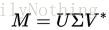  
其中U是m×m阶酉矩阵；Σ是m×n阶非负实数对角矩阵；而V\*，即V的共轭转置，是n×n阶酉矩阵。这样的分解就称作M的奇异值分解。Σ对角线上的元素Σi,i即为M的奇异值。  
常见的做法是将奇异值由大而小排列。如此Σ便能由M唯一确定了。（虽然U和V仍然不能确定。）就是一个将其分解成对角矩阵的过程。  
对于SVD，它的几何意义就是两个坐标轴之间的转换。具体的参考[博客](http://blog.sciencenet.cn/blog-696950-699432.html)。  
特征值的分解其实和SVD的分解类似，只不过SVD可以解决不是方阵的情况，而特征值只能解决方阵的情况。两者关系见[博客](http://www.cnblogs.com/LeftNotEasy/archive/2011/01/19/svd-and-applications.html)。

* * *

关于CPD中使用到的基本的一些定义如下图：  
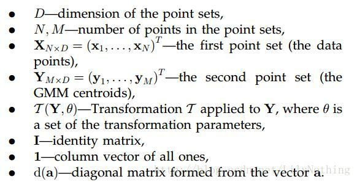  
那么在点集匹配当中就是由一个已有的点集，叫做first point set（也就是data points），这个相当于一个参考点集，另外一个点集就是需要将其像参考点靠近的点集，GMM的中心点集。GMM算法中用到了EM算法来求解，那么EM算法是求解含有隐变量的概率模型参数的极大似然估计算法。那么针对于CPD算法中，X是观测变量，Y是隐变量，要求的高斯模型的参数就是要求的模型参数。论文中有这么一句话：  
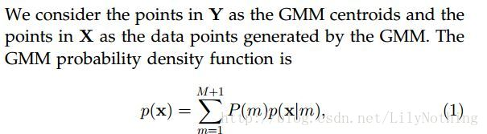  
这句话的含义就是说Y作为高斯函数的中心点，然后求出在这个中心点下能够生成数据点X的概率，要求就是求出这个最大的概率值(这个概率值其实是基于距离的)。其中p(x)表达式如下：  
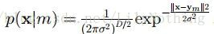  
同时为了能够考虑噪声，添加了一个类似的噪声和利群点分布：p(x|M+1) = 1/N. 同时对于这m个中心点来说，这些数据点是由某个中心点生成的概率都是一样的P(m) = 1/M.假设噪声分布的比重为w，那么这个高斯混合模型就会变成如下形式：  
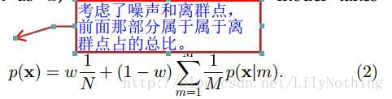  
这个公式加号的前一半部分表示的是噪声和离群点，后面部分针对的是M个高斯中心的情况。整个p(x)表达的就是x这个数据点是由M个GMM中心（还加上了噪声的影响）生成的概率。CPD需要做的事情就是不断更新这些高斯函数中心的位置（是通过修改高斯的参数theta实现的）。就是不断的最大化(2)这个公式，为了将乘法转换为加法，所以对其取对数，转换成如下的形式：  
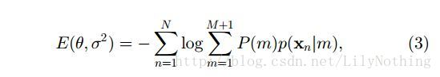  
这个(3)式相当于对（2）式取对数，因为w以及噪声信息是一个固定的值，所以可以去掉这些无关的数字，得到（3）式较为简单的公式，其中的P(m)就是我们之前所说的每个高斯模型所占的比率，这个值也是在不断修改的。对应到GMM算法中的解释的两步：

```
第一步是假设我们知道各个高斯模型的参数（可以初始化一个，或者基于上一步迭代结果），去估计每个高斯模型的权值；
第二步是基于估计的权值，回过头再去确定高斯模型的参数。重复这两个步骤，直到波动很小，近似达到极值（注意这里是个极值不是最值，EM算法会陷入局部最优）
from:
http://blog.csdn.net/jwh_bupt/article/details/7663885
```

将Ym和Xn之间的关系定义为已经给出数据点的高斯中心的后验概率的计算。即如下公式：  
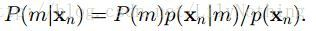  
那么要求这个数据点是由这个对应的模型生成的话（就是两者一致，同时发生的概率）应该是p(m) = p(m|x)p(x),由此得出如下的Q函数：  
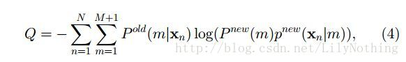  
其中论文中说这个Q函数是(3)式中的对数似然函数的上界。这里可以由(3)式得到(4)：将(3)式中的p(m)p(xn|m)换成p(m|xn)p(xn)，那么对于EM求解GMM的思想来看，p(m|xn)p(xn)前面的p(m|xn)是在已知数据点的情况下，求出模型的参数，那么求出模型参数之后，又来迭代求出数据点，所有后面的数据点p(xn)就是换成new的p(m)p(xn|m).于是便可以得到(4)式。  
再将p（x|m）换成高斯函数的表达式  
然后通过将对数乘法转换为加法最终得到(5)式的内容。  
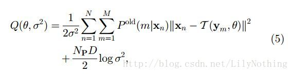  
其中的Np就是旧的P（m|x），求法如下：  
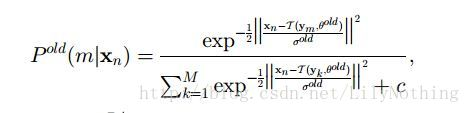  
其中c在论文中写到等于多少。那么目的就是不断的最小化这个Q函数。CPD针对于rigid的算法如下：  
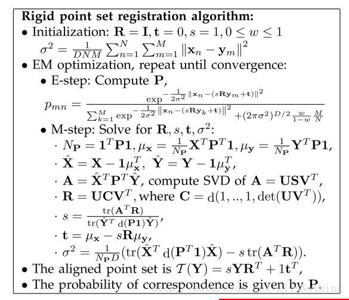  
其中的tr代表的是矩阵的迹。S代表的是点集的尺度变化（密度），R代表的是旋转矩阵。t代表的是转换向量（平移的多少）。其中涉及到SVD的求解。

CPD算法对于形状相同，但是距离较远的点集也是可以进行匹配的，它相对于ICP来说主要的优点就是对于远距离相似的点集是可以进行匹配的。  
通过matlab的代码仿真看出，如果仅仅将一帧和几帧数据组成的关键帧进行匹配，就会出现较大的错误（如下图）初步得出的结论是因为几帧组成的关键帧和单独一帧并不是表示的是同一部分的数据，关键帧虽然也包含了当前这一帧的数据，但是它的数据体现的不仅仅是这一帧，论文中的实验结果中两个点集都是表示了完整的一幅图像。只是他们的密度大小尺度这些因为可能不同。因为GMM算法是考虑了所有的点，那么不是这一帧的点集也会对结果产生影响，导致了不稳定的结果  
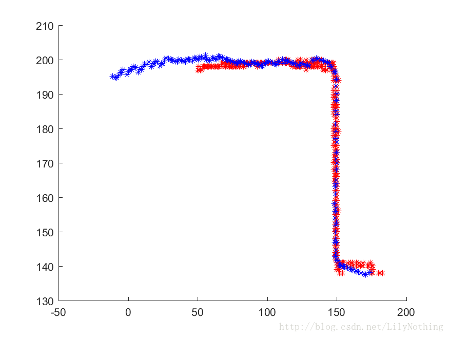

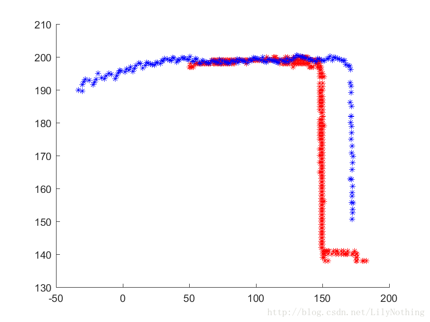

# **ICP：the Iterative Closest Point**

参考：[博客](http://chrisyayu.me/2016/07/07/ICP%28Iterative-Closest-Point%29%E5%AD%A6%E4%B9%A0%E7%AC%94%E8%AE%B0/)

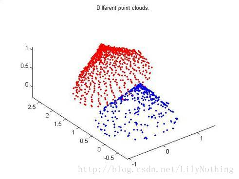  
如上图，点集的匹配算法就是将红色点集和蓝色点集进行匹配。如果知道两个点集之间的一一对应关系，那么就可以直接采用对应点集配准算法来进行实现了。但是现实生活中我们是很少能够知道两个点集之间的一一对应关系的，所以ICP算法的前一步是先找到两个点集中的一一对应的点，然后再进行匹配。**匹配的过程涉及到四元数旋转，坐标平移的操作**。

**ICP算法是先计算出从源点云上的（蓝色部分）每个点到目标点云（红色部分）的每个点的距离，使每个点和目标云的最近点匹配，**（记得这种映射方式叫满射吧）。  
这样满足了对应点集配准算法的前提条件、每个点都有了对应的映射点，则可以按照对应点集配准算法计算，但因为这个是假设，所以需要重复迭代运行上述过程，直到均方差误差小于某个阀值。  
也就是说 每次迭代，整个模型是靠近一点，每次都重新找最近点，然后再根据对应点集批准算法算一次，比较均方差误差，如果不满足就继续迭代。

我们先不管噪声，如果要对两个之间只有平移和旋转变换的点集进行匹配，一种很自然的方法就是先匹配对一个点，然后对整体进行旋转，但ICP算法不是这样，因为它不能保证每次匹配的点都是完全正确的，取而代之，它进行的是点点匹配，将每一个初始点与目标点集进行匹配，在每一个方向上，目标点集与该点作差方和，之后将它们相加取其中的最小值，该值的位置就是该点所需建立的映射对象.对应的matlab代码如下：

```
function [match mindist] = match_bruteForce(q, p) 
%p是初始点集，q是目标点集
    m = size(p,2);%m是初始点集的数据点数目
    n = size(q,2);  %n是目标点集的大小，将初始移到目标
    match = zeros(1,m);
    mindist = zeros(1,m);
    for ki=1:m %在初始点集中找到一个点到目标点集的距离之和最小。
        d=zeros(1,n);
        for ti=1:3
            d=d+(q(ti,:)-p(ti,ki)).^2;
        end
        [mindist(ki),match(ki)]=min(d);
    end

    mindist = sqrt(mindist);
end
```

嗯，我再解释一下，每个方向上（三维的有三个方向）算出来的平方和相加得到的就是初始点与目标点集所有点距离平方的集合，我们取最小值也就是找到了初始点匹配到目标点集中使两者之间距离最近的点，然后我们对初始点集中的所有点都进行这样的操作，不难理解，匹配成功事实上也就是初始点集与目标点集中的对应的每一点之间的距离最小.

这种方法听上去貌似一次就可以完成匹配任务，但事实并不是这样，因为其中除了平移还有旋转变化，要匹配得好只能通过多次迭代来完成.  
但是迭代次数的不断增加也会导致计算量不断的增大，因此后来的zhang（1994）提出的K-D tree的思想解决了复杂度高的问题。  
但是ICP找对应点的过程是基于距离来找的，对于那种形状相似的，但是角度之类有很大的偏差的问题，就会出现错误的匹配。这个ICP的缺点就会由CPD来进行更正。

# **总结**

ICP和CPD可以说是互补的两个算法。当然目前来说CPD似乎是最好的一个匹配算法了。ICP找的是最近的匹配，可能会匹配错误，CPD针对那种一个较长的数据点集和一个较短的数据点集匹配的话，可能不应该匹配的部分会对匹配部分产生影响（因为CPD是整体看成一个函数，会考虑到其它点的分布）。是不是可以综合两者的优点，考虑一下将点集分为局部点集进行匹配呢？先按照距离找到局部对应的点，然后再进行局部匹配是否可以呢？