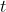

title: icp算法证明
categories:

  - 论文

date: 2021-03-13 10:16:46
description: <read more ...>
mathjax: true
typora-root-url:  icp算法证明

# ICP算法证明

## **问题引入**

        迭代最近点（Iterative Closest Point, 下简称ICP）算法是一种点云匹配算法。

        假设我们通过RGB-D相机得到了第一组点云 ，相机经过位姿变换（旋转加平移）后又拍摄了第二组点云 ,注意这里的  和  的坐标分别对应移动前和移动后的坐标系（即坐标原点始终为相机光心，这里我们有移动前、移动后两个坐标系），并且我们通过相关算法筛选和调整了点云存储的顺序，使得 和 中的点一一对应，如在三维空间中对应同一个点。

        现在我们要解决的问题是：计算相机的旋转   和平移  ，在没有误差的情况下，从 坐标系转换到 的公式为：

                                              

        但由于噪声及错误匹配（如  其实并不对应空间中同一点，但特征匹配算法错误地认为二者是同一点）的存在， 上式不总是成立，所以我们要最小化的目标函数为

                                             

        常用的求解  和  的方法有：

1.  SVD
2.  非线性优化

        非线性优化的描述比较繁琐，下面只介绍SVD方法。为了后面能使用SVD，我们需要在数学上做一点小小的变形。首先定义两组点云的质心（center of mass）为 ,,并作出如下处理：

此处r等于UV参见论文，简单得说就是保证秩最大。

此处要记住得就是R的求解定式。

