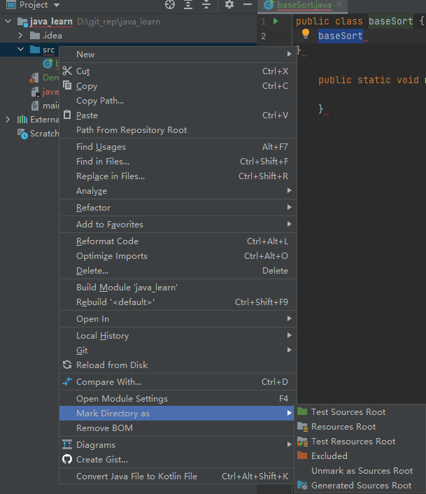

#  创建项目

## 无法新建class文件

IntelliJ 新建文件没有 Java class选项，而且可以看到当前项目src文件夹是灰色状态

这主要是由于当前文件夹不是Source类型目录，只有Sources这种可编译目录才可以新建Java类和包。

解决src右键--->mark directory as --->Sources root，然后可以看到src目录变成蓝色状态

## yte

