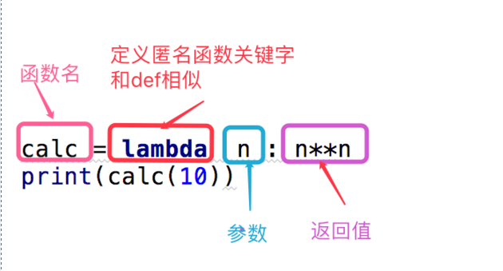
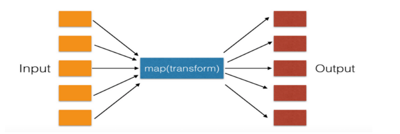
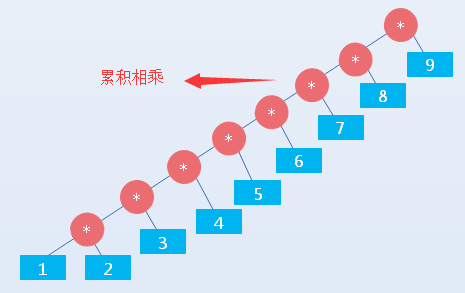
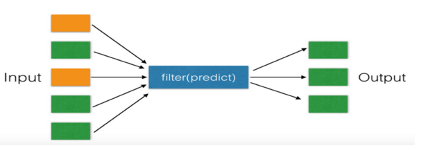
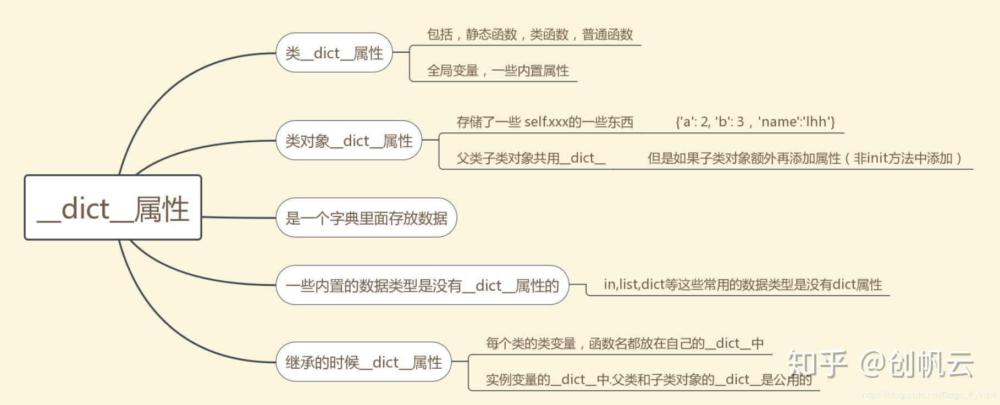

# 字符串基本操作：

## 字符串拼接

通过`+`运算符  
现有字符串`码农飞哥好，`，要求将字符串`码农飞哥牛逼`拼接到其后面，生成新的字符串`码农飞哥好，码农飞哥牛逼`  
举个例子：

```python
str6 = '码农飞哥好，'
# 使用+ 运算符号
print('+运算符拼接的结果=',(str6 + '码农飞哥牛逼'))
```

运行结果是：

```plain
+运算符拼接的结果= 码农飞哥好，码农飞哥牛逼
```

## 字符串截取（字符串切片）

切片操作是访问字符串的另一种方式，它可以访问一定范围内的元素，通过切片操作，可以生成一个新的字符串。切片操作的语法格式是：

```python
sname[start : end : step]
```

各个参数的含义分别是：

1.  sname: 表示字符串的名称
2.  start：表示切片的开始索引位置（包括该位置），此参数也可以不指定，不指定的情况下会默认为0，也就是从序列的开头开始切片。
3.  end：表示切片的结束索引位置（不包括该位置），如果不指定，则默认为序列的长度。
4.  step: 表示步长，即在切片过程中，隔几个存储位置（包括当前位置）取一次元素，也就是说，如果step的值大于1，比如step为3时，则在切片取元素时，会隔2个位置去取下一个元素。  
    还是举个栗子说明下吧：

```python
str1='好好学习，天天向上'
# 取出索引下标为7的值
print(str1[7])
# 从下标0开始取值，一直取到下标为7（不包括）的索引值
print(str1[0:7])
# 从下标1开始取值，一直取到下标为4（不包括）的索引值，因为step等于2，所以会隔1个元素取值
print(str1[1:4:2])
# 取出最后一个元素
print(str1[-1])
# 从下标-9开始取值，一直取到下标为-2（不包括）的索引值
print(str1[-9:-2])
```

运行的结果是：

```plain
向
好好学习，天天
好习
上
好好学习，天天
```

## 分割字符串

Python提供了split()方法用于分割字符串，split() 方法可以实现将一个字符串按照指定的分隔符切分成多个子串，这些子串会被保存到列表中（不包含分隔符），作为方法的返回值反馈回来。该方法的基本语法格式如下：

```python
str.split(sep,maxsplit)
```

此方法中各部分参数的含义分别是：

1.  str: 表示要进行分割的字符串
2.  sep: 用于指定分隔符，可以包含多个字符，此参数默认为None，表示所有空字符，包括空格，换行符"\\n"、制表符"\\t"等
3.  maxsplit: 可选参数，用于指定分割的次数，最后列表中子串的个数最多为maxsplit+1，如果不指定或者指定为-1，则表示分割次数没有限制。  
    在 split 方法中，如果不指定 sep 参数，那么也不能指定 maxsplit 参数。  
    举例说明下：

```python
str = 'https://feige.blog.csdn.net/'
print('不指定分割次数', str.split('.'))
print('指定分割次数为2次',str.split('.',2))
```

运行结果是：

```css
不指定分割次数 ['https://feige', 'blog', 'csdn', 'net/']
指定分割次数为2次 ['https://feige', 'blog', 'csdn.net/']
```

## 合并字符串

合并字符串与split的作用刚刚相反，Python提供了join() 方法来将列表（或元组）中包含的多个字符串连接成一个字符串。其语法结构是：

```python
newstr = str.join(iterable)
```

此方法各部分的参数含义是：

1.  newstr: 表示合并后生成的新字符串
2.  str: 用于指定合并时的分隔符
3.  iterable: 做合并操作的源字符串数据，允许以列表、元组等形式提供。  
    依然是举例说明：

```python
list = ['码农飞哥', '好好学习', '非常棒']
print('通过.来拼接', '.'.join(list))
print('通过-来拼接', '-'.join(list))
```

运行结果是：

```plain
通过.来拼接 码农飞哥.好好学习.非常棒
通过-来拼接 码农飞哥-好好学习-非常棒
```

## 统计字符串出现的次数

count()方法用于检索指定字符串在另一字符串中出现的次数，如果检索的字符串不存在，则返回0，否则返回出现的次数。其语法结构是：

```python
str.count(sub[,start[,end]])
```

此方法各部分参数的含义是：

1.  str: 表示原字符串
2.  sub: 表示要检索的字符串.
3.  start: 指定检索的起始位置，也就是从什么位置开始检测，如果不指定，默认从头开始检索。
4.  end: 指定检索的终止位置，如果不指定，则表示一直检索到结尾  
    举个例子说明：

```python
str = 'https://feige.blog.csdn.net/'
print('统计.出现的次数', str.count('.'))
print('从1位置到倒数第五个位置统计.出现的次数', str.count('.', 1, -5))
```

运行结果是：

```yaml
统计.出现的次数 3
从1位置到倒数第6个位置统计.出现的次数 2
```

## 检测字符串是否包含某子串

Python提供find方法，用于检索字符串中是否包含目标字符串，如果包含，则返回第一次出现该字符串的索引，反之，则返回-1。其语法结构是：

```python
str.find(sub[,start[,end]])
```

此方法各参数的含义是：

1.  str: 表示原字符串
2.  sub: 表示要检索的目标字符串
3.  start: 表示开始检索的起始位置，如果不指定，则默认从头开始检索
4.  end: 表示结束检索的结束位置，如果不指定，则默认一直检索到结尾。  
    Python还提供了rfind()方法，与find()方法最大的不同在于，rfind()是从字符串右边开始检索。  
    依然是举例说明：

```python
str = '码农飞哥'
print('检索是否包含字符串"飞哥"', str.find('飞哥'))
print("检索是否包含字符串'你好'", str.find('你好'))
```

运行结果是：

```plain
检索是否包含字符串"飞哥" 2
检索是否包含字符串'你好' -1
```

Python还提供了indext()方法检测字符串中是否包含某子串，方法的参数与find方法相同，唯一不同之处在于当指定的字符串不存在时，index()方法会抛出异常。在此就不在赘述了。

## 字符串对齐方法

Python str提供了3种可用来进行文本对齐的方法，分别是ljust()，rjust()和center()方法

1.  ljust()用于向指定字符串的右侧填充指定字符，从而达到左对齐文本的目的，其语法结构是：

```python
S.ljust(width[, fillchar])
```

此方法中各个参数的含义是：

*   S: 表示要进行填充的字符串
*   width: 表示包括S本身长度在内，字符串要占的总长度
*   fillchar: 作为可选参数，用来指定填充字符串时所用的字符，默认情况使用空格。

2.  rjust() 方法是向字符串的左侧填充指定字符，从而达到右对齐文本的目的。
3.  center()方法用于让文本居中，而不是左对齐或右对齐  
    举个例子说明下：

```python
str1 = 'https://feige.blog.csdn.net/'
str2 = 'https://www.baidu.com/'
print("通过-实现左对齐", str1.ljust(30, '-'))
print("通过-实现左对齐", str2.ljust(30, '-'))
print("通过-实现右对齐", str1.rjust(30, '-'))
print("通过-实现右对齐", str2.rjust(30, '-'))
print("通过-实现居中对齐", str1.center(30, '-'))
print("通过-实现居中对齐", str2.center(30, '-'))
```

运行结果是：

```coffeescript
通过-实现左对齐 https://feige.blog.csdn.net/--
通过-实现左对齐 https://www.baidu.com/--------
通过-实现右对齐 --https://feige.blog.csdn.net/
通过-实现右对齐 --------https://www.baidu.com/
通过-实现居中对齐 -https://feige.blog.csdn.net/-
通过-实现居中对齐 ----https://www.baidu.com/----
```

## 检索字符串是否以指定字符串开头（startswith()）

startswith()方法用于检索字符串是否以指定字符串开头，如果是返回True；反之返回False。其语法结构是：

```python
str.startswith(sub[,start[,end]])
```

此方法各个参数的含义是：

1.  str: 表示原字符串
2.  sub: 要检索的子串‘
3.  start: 指定检索开始的起始位置索引，如果不指定，则默认从头开始检索
4.  end: 指定检索的结束位置索引，如果不指定，则默认一直检索到结束。  
    举个栗子说明下：

```python
str1 = 'https://feige.blog.csdn.net/'
print('是否是以https开头', str1.startswith('https'))
print('是否是以feige开头', str1.startswith('feige', 0, 20))
```

运行结果是：

```yaml
是否是以https开头 True
是否是以feige开头 False
```

## 检索字符串是否以指定字符串结尾（endswith()）

endswith()方法用于检索字符串是否以指定字符串结尾，如果是则返回True,反之则返回False。其语法结构是：

```python
str.endswith(sub[,start[,end]])
```

此方法各个参数的含义与startswith方法相同，再此就不在赘述了。  

## 字符串大小写转换（3种）函数及用法

Python中提供了3种方法用于字符串大小写转换

1.  title()方法用于将字符串中每个单词的首字母转成大写，其他字母全部转为小写。转换完成后，此方法会返回转换得到的字符串。如果字符串中没有需要被转换的字符，此方法会将字符串原封不动地返回。其语法结构是`str.title()`
2.  lower()用于将字符串中的所有大写字母转换成小写字母，转换完成后，该方法会返回新得到的子串。如果字符串中原本就都是小写字母，则该方法会返回原字符串。 其语法结构是`str.lower()`
3.  upper()用于将字符串中的所有小写字母转换成大写字母，如果转换成功，则返回新字符串；反之，则返回原字符串。其语法结构是：`str.upper()`。  
    举例说明下吧：

```python
str = 'feiGe勇敢飞'
print('首字母大写', str.title())
print('全部小写', str.lower())
print('全部大写', str.upper())
```

运行结果是：

```plain
首字母大写 Feige勇敢飞
全部小写 feige勇敢飞
全部大写 FEIGE勇敢飞
```

## 去除字符串中空格（删除特殊字符）的3种方法

Python中提供了三种方法去除字符串中空格（删除特殊字符）的3种方法，这里的特殊字符，指的是指表符(\\t)、回车符(\\r),换行符(\\n)等。

1.  strip()： 删除字符串前后（左右两侧）的空格或特殊字符
2.  lstrip()：删除字符串前面（左边）的空格或特殊字符
3.  rstrip():删除字符串后面（右边）的空格或特殊字符  
    Python的str是不可变的，因此这三个方法只是返回字符串前面或者后面空白被删除之后的副本，并不会改变字符串本身  
    举个例子说明下：

```python
str = '\n码农飞哥勇敢飞 '
print('去除前后空格(特殊字符串)', str.strip())
print('去除左边空格(特殊字符串)', str.lstrip())
print('去除右边空格(特殊字符串)', str.rstrip())
```

运行结果是：

```python
去除前后空格(特殊字符串) 码农飞哥勇敢飞
去除左边空格(特殊字符串) 码农飞哥勇敢飞 
去除右边空格(特殊字符串) 
码农飞哥勇敢飞
```

## encode()和decode()方法：字符串编码转换

最早的字符串编码是ASCll编码，它仅仅对10个数字，26个大小写英文字母以及一些特殊字符进行了编码，ASCII码最多只能表示256个字符，每个字符只需要占用1个字节。为了兼容各国的文字，相继出现了GBK，GB2312,UTF-8编码等，UTF-8是国际通用的编码格式，它包含了全世界所有国家需要用到的字符，其规定英文字符占用1个字节，中文字符占用3个字节。

1.  encode() 方法为字符串类型（str）提供的方法，用于将 str 类型转换成 bytes 类型，这个过程也称为“编码”。其语法结构是：`str.encode([encoding="utf-8"][,errors="strict"])`
2.  将bytes类型的二进制数据转换成str类型。这个过程也称为"解码"，其语法结构是：`bytes.decode([encoding="utf-8"][,errors="strict"])`  
    举个例子说明下：

```python
str = '码农飞哥加油'
bytes = str.encode()
print('编码', bytes)
print('解码', bytes.decode())
```

运行结果是：

```plain
编码 b'\xe7\xa0\x81\xe5\x86\x9c\xe9\xa3\x9e\xe5\x93\xa5\xe5\x8a\xa0\xe6\xb2\xb9'
解码 码农飞哥加油
```

**默认的编码格式是UTF-8，编码和解码的格式要相同，不然会解码失败。**

## 序列化和反序列化

在实际工作中我们经常要将一个数据对象序列化成字符串，也会将一个字符串反序列化成一个数据对象。Python自带的序列化模块是json模块。

1.  json.dumps() 方法是将Python对象转成字符串
2.  json.loads()方法是将已编码的 JSON 字符串解码为 Python 对象  
    举个例子说明下：

```python
import json

dict = {'学号': 1001, 'name': "张三", 'score': [{'语文': 90, '数学': 100}]}
str = json.dumps(dict,ensure_ascii=False)
print('序列化成字符串', str, type(str))
dict2 = json.loads(str)
print('反序列化成对象', dict2, type(dict2))
```

运行结果是：

```coffeescript
序列化成字符串 {"name": "张三", "score": [{"数学": 100, "语文": 90}], "学号": 1001} <class 'str'>
反序列化成对象 {'name': '张三', 'score': [{'数学': 100, '语文': 90}], '学号': 1001} <class 'dict'>
```


# 继承

~~~python
 class A(B):
 #A继承B
#重写父类方法
def 函数（self，参数）：
#self是实例，定义时需要写，调用自动传入
def __init__(self):
     #调用父辈的同名方法都是这样的调用 super（本类名，self）.方法
    super(self,Model).__init__()
#python中的super( test, self).init()
#首先找到test的父类（比如是类A），然后把类test的对象self转换为类A的对象，然后“被转换”的类A对象调用自己的__init__函数.
~~~

# 匿名函数


## 匿名函数

匿名函数就是不需要显式的指定函数名。



关键字`lambda`表示匿名函数，冒号前面的`n`表示函数参数，可以有多个参数。

匿名函数有个限制，就是只能有一个表达式，不用写`return`，返回值就是该表达式的结果。

用匿名函数有个好处，因为函数没有名字，不必担心函数名冲突。此外，匿名函数也是一个函数对象，也可以把匿名函数赋值给一个变量，再利用变量来调用该函数：

有些函数在代码中只用一次，而且函数体比较简单，使用匿名函数可以减少代码量，看起来比较"优雅“


```plain
#这段代码
def calc(x,y):
    return x**y

#换成匿名函数
calc = lambda x,y:x**y
print(calc(2,5))

def calc(x,y):
    if x > y:
        return x*y
    else:
        return x / y
    
#三元运算换成匿名函数
calc = lambda x,y:x * y if x > y else x / y
print(calc(2,5))
```


## 匿名函数使用场景：

主要与其他函数联合使用

### **map函数**

`map()`函数接收两个参数，一个是函数，一个是`Iterable`，`map`将传入的函数依次作用到序列的每个元素，并把结果作为新的`Iterator`返回

遍历序列，对序列中每个元素进行函数操作，最终获取新的序列。



1.求列表\[1,2,3,4,5,6,7,8,9\],返回一个n\*n 的列表


```plain
#一般解决方案
li = [1,2,3,4,5,6,7,8,9]
for ind,val in enumerate(li):
    li[ind] = val * val
print(li)
# [1, 4, 9, 16, 25, 36, 49, 64, 81]

# 高级解决方案
li = [1,2,3,4,5,6,7,8,9]
print(list(map(lambda x:x*x,li)))
# [1, 4, 9, 16, 25, 36, 49, 64, 81]
```


### **reduce函数**

`reduce`把一个函数作用在一个序列`[x1, x2, x3, ...]`上，这个函数必须接收两个参数，`reduce`把结果继续和序列的下一个元素做累积计算，其效果就是：

reduce(func,\[1,2,3\]) 等同于 func(func(1,2),3)

对于序列内所有元素进行累计操作




```plain
#接受一个list并利用reduce()求积
from functools import reduce
li = [1,2,3,4,5,6,7,8,9]
print(reduce(lambda x,y:x * y,li))
# 结果=1*2*3*4*5*6*7*8*9 = 362880
```

### **filter函数**

`filter()`也接收一个函数和一个序列。和`map()`不同的是，`filter()`把传入的函数依次作用于每个元素，然后根据返回值是`True`还是`False`决定保留还是丢弃该元素。

对于序列中的元素进行筛选，最终获取符合条件的序列




```plain
# 在一个list中，删掉偶数，只保留奇数
li = [1, 2, 4, 5, 6, 9, 10, 15]
print(list(filter(lambda x:x % 2==1,li)))  # [1, 5, 9, 15]

# 回数是指从左向右读和从右向左读都是一样的数，例如12321，909。请利用filter()筛选出回数
li = list(range(1, 200))
print(list(filter(lambda x:int(str(x))==int(str(x)[::-1]),li)))
[1, 2, 3, 4, 5, 6, 7, 8, 9, 11, 22, 33, 44, 55, 66, 77, 88, 99, 101, 111, 121, 131, 141, 151, 161, 171, 181, 191]
```


### sorted函数

sorted(iterable, /, \*, key=None, reverse=False)

接收一个`key`函数来实现对可迭代对象进行自定义的排序

可迭代对象：主要与列表，字符串，元祖，集合和字典

key：接受一个函数，根据此函数返回的结果，进行排序

reverse：排序方向，默认为从小到大，reverse=True为逆向


```plain
# 对列表按照绝对值进行排序
li= [-21, -12, 5, 9, 36]
print(sorted(li, key = lambda x:abs(x)))
# [5, 9, -12, -21, 36]

"""
sorted()函数按照keys进行排序，并按照对应关系返回list相应的元素：

keys排序结果 => [5, 9,  12,  21, 36]
                |  |    |    |   |
最终结果     => [5, 9, -12, -21, 36]
"""
```


```plain
# 把下面单词以首字母排序
li = ['bad', 'about', 'Zoo', 'Credit']
print(sorted(li, key = lambda x : x[0]))
# 输出['Credit', 'Zoo', 'about', 'bad']
"""
对字符串排序，是按照ASCII的大小比较的，由于'Z' < 'a'，结果，大写字母Z会排在小写字母a的前面。
"""

# 假设我们用一组tuple表示学生名字和成绩：

L = [('Bob', 75), ('Adam', 92), ('Bart', 66), ('Lisa', 88)]
# 请用sorted()对上述列表分别按名字排序
print(sorted(L, key = lambda x : x[0]))
# 输出[('Adam', 92), ('Bart', 66), ('Bob', 75), ('Lisa', 88)]

# 再按成绩从高到低排序
print(sorted(L, key = lambda x : x[1], reverse=True))
# 输出[('Adam', 92), ('Lisa', 88), ('Bob', 75), ('Bart', 66)]
```


# 魔法函数

​	**魔法函数是在类中以双下划线开头，双下划线结尾的，python本身给我们定义了许多这种方法，让我们能在类中直接使用。**

## __init__和getitem

​	魔法函数就是函数操作的重定义，比如getitem，当python执行键对操作时就执行这个函数

如果类把某个属性定义为序列，可以使用__getitem__()输出序列属性中的某个元素.如下将employee设置为list。

~~~python
#遍历实例中所有元素
class Company(object):
    def __init__(self, employee_list):
        self.employee = employee_list

company = Company(['tom', 'bob', 'jane'])
employee = company.employee

for em in employee :
    print(em)

~~~

~~~python
class Company(object):
    def __init__(self, employee_list):
        self.employee = employee_list
	#item是序列号
    def __getitem__(self, item):
        return self.employee[item]

company = Company(['tom', 'bob', 'jane'])

for em in company:
    print(em)

~~~

## __dict__

　


# 内置函数

~~~python
>>>seasons = ['Spring', 'Summer', 'Fall', 'Winter']
>>> list(enumerate(seasons))
[(0, 'Spring'), (1, 'Summer'), (2, 'Fall'), (3, 'Winter')]
>>> list(enumerate(seasons, start=1))       # 下标从 1 开始
[(1, 'Spring'), (2, 'Summer'), (3, 'Fall'), (4, 'Winter')]
~~~

# 装饰器

## python @property的介绍与使用

python的@property是python的一种装饰器，是用来修饰方法的。

作用：

我们可以使用@property装饰器来创建**只读属性**，@property装饰器会将**方法**转换为相同名称的**只读属性**,可以与所定义的属性配合使用，这样可以防止属性被修改。

使用场景：

1.修饰方法，是方法可以像属性一样访问。

```python
class DataSet(object):
  @property
  def method_with_property(self): ##含有@property
      return 15
  def method_without_property(self): ##不含@property
      return 15

l = DataSet()
print(l.method_with_property) # 加了@property后，可以用调用属性的形式来调用方法,后面不需要加（）。
print(l.method_without_property())  #没有加@property , 必须使用正常的调用方法的形式，即在后面加()
```

两个都输出为15。

```python
class DataSet(object):
  @property
  def method_with_property(self): ##含有@property
      return 15
l = DataSet()
print(l.method_with_property（）) # 加了@property后，可以用调用属性的形式来调用方法,后面不需要加（）。
```

如果使用property进行修饰后，又在调用的时候，方法后面添加了()， 那么就会显示错误信息：TypeError: 'int' object is not callable，也就是说添加@property 后，这个方法就变成了一个属性，如果后面加入了()，那么就是当作函数来调用，而它却不是callable（可调用）的。

```python
class DataSet(object):
  def method_without_property(self): ##不含@property
      return 15
l = DataSet()
print(l.method_without_property） #没有加@property , 必须使用正常的调用方法的形式，即在后面加()
```

没有使用property修饰，它是一种方法，如果把括号去掉，不会报错输出的就会是方法存放的地址。

2.与所定义的属性配合使用，这样可以防止属性被修改。

 由于python进行属性的定义时，没办法设置私有属性，因此要通过@property的方法来进行设置。这样可以隐藏属性名，让用户进行使用的时候无法随意修改。

```python
class DataSet(object):
    def __init__(self):
        self._images = 1
        self._labels = 2 #定义属性的名称
    @property
    def images(self): #方法加入@property后，这个方法相当于一个属性，这个属性可以让用户进行使用，而且用户有没办法随意修改。
        return self._images 
    @property
    def labels(self):
        return self._labels
l = DataSet()
#用户进行属性调用的时候，直接调用images即可，而不用知道属性名_images，因此用户无法更改属性，从而保护了类的属性。
print(l.images) # 加了@property后，可以用调用属性的形式来调用方法,后面不需要加（）。
```

## @staticmethod

将方法设置为类的静态方法。


# numpy库

## cumsum

~~~python
arr = np.array([[[1,2,3],[8,9,12]],[[1,2,4],[2,4,5]]]) #2*2*3
print(arr)

print(arr.cumsum(0))
print(arr.cumsum(1))
print(arr.cumsum(2))
#arr输出
[[[ 1  2  3]
  [ 8  9 12]]

 [[ 1  2  4]
  [ 2  4  5]]]
#对cumsum（0）表示0维度操作，arr[0]加到arr[1]
#arr.cumsum(0)，上面块加到下面
[[[ 1  2  3]
  [ 8  9 12]]

 [[ 2  4  7]
  [10 13 17]]]
#cumsum(1)
[[[ 1  2  3]
  [ 9 11 15]]
 
 [[ 1  2  4]
  [ 3  6  9]]]
#cumsum(2)
[[[ 1  3  6]
  [ 8 17 29]]
 
 [[ 1  3  7]
  [ 2  6 11]]]
#0去第一个轴，按轴累加
#其他同理
~~~

## np.concatenate

~~~python
a=np.array([[1,2,3],[4,5,6]])
b=np.array([[11,21,31],[7,8,9]])
print(np.concatenate((a,b),axis=1))
#[[ 1  2  3 11 21 31]
#[ 4  5  6  7  8  9]]
~~~

## np.zeros

##  np.sort

## **numpy.arange([start, ]stop, [step, ]dtype=None)**

在给定的时间间隔内返回均匀间隔的值。

numpy.random.randn()用法

在python数据分析的学习和应用过程中，经常需要用到numpy的随机函数，由于随机函数random的功能比较多，经常会混淆或记不住，下面我们一起来汇总学习下。

```python
import numpy as np
```

## numpy.random.rand()

numpy.random.rand(d0,d1,…,dn)

*   rand函数根据给定维度生成\[0,1)之间的数据，包含0，不包含1
*   dn表格每个维度
*   返回值为指定维度的array

```python
np.random.rand(4,2)
```

```yaml
array([[ 0.02173903,  0.44376568],
       [ 0.25309942,  0.85259262],
       [ 0.56465709,  0.95135013],
       [ 0.14145746,  0.55389458]])
```

```python
np.random.rand(4,3,2) # shape: 4*3*2
```

```yaml
array([[[ 0.08256277,  0.11408276],
        [ 0.11182496,  0.51452019],
        [ 0.09731856,  0.18279204]],
 
       [[ 0.74637005,  0.76065562],
        [ 0.32060311,  0.69410458],
        [ 0.28890543,  0.68532579]],
 
       [[ 0.72110169,  0.52517524],
        [ 0.32876607,  0.66632414],
        [ 0.45762399,  0.49176764]],
 
       [[ 0.73886671,  0.81877121],
        [ 0.03984658,  0.99454548],
        [ 0.18205926,  0.99637823]]])
```

## numpy.random.randn()

numpy.random.randn(d0,d1,…,dn)

*   randn函数返回一个或一组样本，具有标准正态分布。
*   dn表格每个维度
*   返回值为指定维度的array

```python
np.random.randn() # 当没有参数时，返回单个数据
```

```plain
-1.1241580894939212
```

```python
np.random.randn(2,4)
```

```yaml
array([[ 0.27795239, -2.57882503,  0.3817649 ,  1.42367345],
       [-1.16724625, -0.22408299,  0.63006614, -0.41714538]])
```

```python
np.random.randn(4,3,2)
```

```yaml
array([[[ 1.27820764,  0.92479163],
        [-0.15151257,  1.3428253 ],
        [-1.30948998,  0.15493686]],
 
       [[-1.49645411, -0.27724089],
        [ 0.71590275,  0.81377671],
        [-0.71833341,  1.61637676]],
 
       [[ 0.52486563, -1.7345101 ],
        [ 1.24456943, -0.10902915],
        [ 1.27292735, -0.00926068]],
 
       [[ 0.88303   ,  0.46116413],
        [ 0.13305507,  2.44968809],
        [-0.73132153, -0.88586716]]])
```

标准正态分布介绍

*   标准正态分布—-standard normal distribution
*   标准正态分布又称为u分布，是以0为均值、以1为标准差的正态分布，记为N（0，1）。

## numpy.random.randint()

## numpy.random.randint()

numpy.random.randint(low, high=None, size=None, dtype=’l’)

*   返回随机整数，范围区间为\[low,high），包含low，不包含high
*   参数：low为最小值，high为最大值，size为数组维度大小，dtype为数据类型，默认的数据类型是np.int
*   high没有填写时，默认生成随机数的范围是\[0，low)

```python
np.random.randint(1,size=5) # 返回[0,1)之间的整数，所以只有0
```

```plain
array([0, 0, 0, 0, 0])
```

```python
np.random.randint(1,5) # 返回1个[1,5)时间的随机整数
```

```yaml
4
```

```python
np.random.randint(-5,5,size=(2,2))
```

```lua
array([[ 2, -1],       [ 2,  0]])
```

##  numpy.random.random\_integers

numpy.random.random\_integers(low, high=None, size=None)

*   返回随机整数，范围区间为\[low,high\]，包含low和high
*   参数：low为最小值，high为最大值，size为数组维度大小
*   high没有填写时，默认生成随机数的范围是\[1，low\]

该函数在最新的numpy版本中已被替代，建议使用randint函数

```python
np.random.random_integers(1,size=5)
```

```plain
array([1, 1, 1, 1, 1])
```

4 生成\[0,1)之间的浮点数

*   numpy.random.random\_sample(size=None)
*   numpy.random.random(size=None)
*   numpy.random.ranf(size=None)
*   numpy.random.sample(size=None)

```python
print('-----------random_sample--------------')print(np.random.random_sample(size=(2,2)))print('-----------random--------------')print(np.random.random(size=(2,2)))print('-----------ranf--------------')print(np.random.ranf(size=(2,2)))print('-----------sample--------------')print(np.random.sample(size=(2,2)))
```

```lua
-----------random_sample--------------[[ 0.34966859  0.85655008] [ 0.16045328  0.87908218]]-----------random--------------[[ 0.25303772  0.45417512] [ 0.76053763  0.12454433]]-----------ranf--------------[[ 0.0379055   0.51288667] [ 0.71819639  0.97292903]]-----------sample--------------[[ 0.59942807  0.80211491] [ 0.36233939  0.12607092]]
```

5 numpy.random.choice()

numpy.random.choice(a, size=None, replace=True, p=None)

*   从给定的一维数组中生成随机数
*   参数： a为一维数组类似数据或整数；size为数组维度；p为数组中的数据出现的概率
*   a为整数时，对应的一维数组为np.arange(a)

```python
np.random.choice(5,3)
```

```plain
array([4, 1, 4])
```

```python
np.random.choice(5, 3, replace=False)# 当replace为False时，生成的随机数不能有重复的数值
```

```plain
array([0, 3, 1])
```

```python
np.random.choice(5,size=(3,2))
```

```lua
array([[1, 0],       [4, 2],       [3, 3]])
```

```python
demo_list = ['lenovo', 'sansumg','moto','xiaomi', 'iphone']np.random.choice(demo_list,size=(3,3))
```

```plain
array([['moto', 'iphone', 'xiaomi'],       ['lenovo', 'xiaomi', 'xiaomi'],       ['xiaomi', 'lenovo', 'iphone']],      dtype='<U7')
```

*   参数p的长度与参数a的长度需要一致；
*   参数p为概率，p里的数据之和应为1

```python
demo_list = ['lenovo', 'sansumg','moto','xiaomi', 'iphone']np.random.choice(demo_list,size=(3,3), p=[0.1,0.6,0.1,0.1,0.1])
```

```plain
array([['sansumg', 'sansumg', 'sansumg'],       ['sansumg', 'sansumg', 'sansumg'],       ['sansumg', 'xiaomi', 'iphone']],      dtype='<U7')
```

## numpy.random.seed()

*   np.random.seed()的作用：使得随机数据可预测。
*   当我们设置相同的seed，每次生成的随机数相同。如果不设置seed，则每次会生成不同的随机数

```python
np.random.seed(0)np.random.rand(5)
```

```plain
array([ 0.5488135 ,  0.71518937,  0.60276338,  0.54488318,  0.4236548 ])
```

```python
np.random.seed(1676)np.random.rand(5)
```

```plain
array([ 0.39983389,  0.29426895,  0.89541728,  0.71807369,  0.3531823 ])
```

```python
np.random.seed(1676)np.random.rand(5)
```

```plain
array([ 0.39983389,  0.29426895,  0.89541728,  0.71807369,  0.3531823 ])    
```

## numpy实现范数

```python
import numpy as np

x = np.array([
    [0, 3, 4],
    [1, 6, 4]])
y=np.array([
    [[1,2],[2,2],[3,2]],
    [[1,2],[2,2],[3,2]],
])

```


```python
print("默认参数(矩阵整体元素平方和开根号，不保留矩阵二维特性)：", np.linalg.norm(x))
print("矩阵整体元素平方和开根号，保留矩阵二维特性：", np.linalg.norm(x, keepdims=True))
```

    默认参数(矩阵整体元素平方和开根号，不保留矩阵二维特性)： 8.831760866327848
    矩阵整体元素平方和开根号，保留矩阵二维特性： [[8.83176087]]


1. 求向量的范数
2. 求矩阵的范数


```python
print("矩阵每个行向量求向量的2范数：", np.linalg.norm(x, axis=1, keepdims=True))
print("矩阵每个列向量求向量的2范数：", np.linalg.norm(x, axis=0, keepdims=True))

```

    矩阵每个行向量求向量的2范数： [[5.        ]
     [7.28010989]]
    矩阵每个列向量求向量的2范数： [[1.         6.70820393 5.65685425]]


```python
print("矩阵1范数：", np.linalg.norm(x, ord=1, keepdims=True))
print("矩阵2范数：", np.linalg.norm(x, ord=2, keepdims=True))
print("矩阵∞范数：", np.linalg.norm(x, ord=np.inf, keepdims=True))
```

    矩阵1范数： [[9.]]
    矩阵2范数： [[8.70457079]]
    矩阵∞范数： [[11.]]


**矩阵的范数：**

ord=1：列和的最大值

ord=2：|λE-ATA|=0，求特征值，然后求最大特征值得算术平方根([matlab在线版](https://octave-online.net/)，计算ans=ATA，\[x,y\]=eig(ans)，sqrt(y)，x是特征向量，y是特征值)

ord=∞：行和的最大值

ord=None：默认情况下，是求整体的矩阵元素平方和，再开根号。（没仔细看，以为默认情况下就是矩阵的二范数，修正一下，默认情况下是求整个矩阵元素平方和再开根号）

③axis：处理类型

axis=1表示按行向量处理，求多个行向量的范数

axis=0表示按列向量处理，求多个列向量的范数

axis=None表示矩阵范数。

④keepding：是否保持矩阵的二维特性

True表示保持矩阵的二维特性，False相反

```python
print("矩阵每个行向量求向量的1范数：", np.linalg.norm(x, ord=1, axis=1, keepdims=True))
print(x.shape)
print(y.shape)
print(np.linalg.norm(y,axis=0,keepdims=True))
print(np.linalg.norm(y,axis=0,keepdims=True).shape)
```

    矩阵每个行向量求向量的1范数： [[ 7.]
     [11.]]
    (2, 3)
    (2, 3, 2)
    [[[1.41421356 2.82842712]
      [2.82842712 2.82842712]
      [4.24264069 2.82842712]]]
    (1, 3, 2)

这个地方维度参数选择，axis=0，表示第一维度消去

# gparse库

利用 argparse 存参数

~~~python
def parameter():
    parser = argparse.ArgumentParser(description='TextCNN model parameter ')
    parser.add_argument('-batch_size',default=10,help='the train batch size')
    parser.add_argument('-epoch',default=5,help='the time need train')
    parser.add_argument('-learing_rate',default=1e-3)
    parser.add_argument('-embed_size',default=100,help='the word dimensionality')
    parser.add_argument('-output_size',default=2)
    parser.add_argument('-k',default=10,help='the cross validation size')
    parser.add_argument('-dropout_rate',default=0.1,help='dropout layer')
    args = parser.parse_args() 
    
    return args

~~~

```python
from  untitled1 import parameter
 
import torch
import torch.nn as nn
from torch.utils.data import DataLoader,Dataset
import torch.nn.functional as F
 
args = parameter() #参数
 
x = torch.rand(100,25,args.embed_size) #100个句子,25个词,embed_size
label = [0] *50 +[1]*50
label = torch.tensor(label,dtype=torch.long)
 
 
class DataSet(Dataset):
    def __init__(self,X,label):
        self.x_data = X
        self.y_data = label
        self.len = len(label)
    
    def __getitem__(self,index):
        return self.x_data[index],self.y_data[index]
    def __len__(self):
        return self.len
    
class textCNN(nn.Module):
    def __init__(self,words_num):
        super(textCNN, self).__init__()
        self.words_num = words_num
        self.embed_size = args.embed_size  #args
        self.class_num = args.output_size  #args
        self.drop_rate = args.dropout_rate
        
        self.conv1 = nn.Sequential(
            nn.Conv2d(1,3,(3,self.embed_size)),
            nn.BatchNorm2d(3)) ###in_channels, out_channels, kernel_size
        self.conv2 = nn.Sequential(
            nn.Conv2d(1,3,(4,self.embed_size)),
            nn.BatchNorm2d(3)) 
        self.conv3 = nn.Sequential(
            nn.Conv2d(1,3,(5,self.embed_size)),
            nn.BatchNorm2d(3))
        
        self.max_pool1 = nn.MaxPool1d(5)
        self.max_pool2 = nn.MaxPool1d(4)
        self.max_pool3 = nn.MaxPool1d(3)
        
        self.dropout = nn.Dropout(self.drop_rate)
        self.linear = nn.Linear(48,self.class_num) ##后面算出来的
        # 3 -> out_channels 3 ->kernel_size 1 ->max_pool
    
    def forward(self,sen_embed): #(batch,max_len,embed_size)
        sen_embed = sen_embed.unsqueeze(1) #(batch,in_channels,max_len,embed_size)
        
        conv1 = F.relu(self.conv1(sen_embed))  # ->(batch_size,out_channels,output.size,1)
        conv2 = F.relu(self.conv2(sen_embed))
        conv3 = F.relu(self.conv3(sen_embed))
        
        conv1 = torch.squeeze(conv1,dim=3)
        conv2 = torch.squeeze(conv2,dim=3)
        conv3 = torch.squeeze(conv3,dim=3)
        
        x1 = self.max_pool1(conv1)
        x2 = self.max_pool2(conv2)
        x3 = self.max_pool3(conv3) ##batch_size,out_channel,18
        
        x1 = x1.view(x1.size()[0],-1) ###batch_size 不能等于1
        x2 = x2.view(x2.size()[0],-1)
        x3 = x3.view(x3.size()[0],-1)
        
        x = torch.cat((x1,x2),dim=1)
        x = torch.cat((x,x3),dim=1)
        output = self.linear(self.dropout(x))
        
        return output 
 
dataset =  DataSet(x, label) 
data_loader = DataLoader(dataset,args.batch_size, shuffle=True) 
 
model = textCNN(25) #word_num
 
loss_function = nn.CrossEntropyLoss()
def train(args,model,data_loader,loss_function):
    optimizer = torch.optim.SGD(model.parameters(), lr=args.learing_rate)
    criterion = loss_function
    model.train() 
    for epoch in range(args.epoch): ##2个epoch
        for step,(x,target) in enumerate(data_loader): 
            output = model(x)
            loss = criterion(output,target)
            optimizer.zero_grad()
            #loss.backward()
            loss.backward(retain_graph=True)
            optimizer.step()
        print(epoch)
train(args,model,data_loader,loss_function)

```

# 文件操作

## 常见函数

```python
os.path.abspath(path) #返回绝对路径（包含文件名的全路径）

os.path.basename(path) —— 去掉目录路径获取(带后缀的)文件名

os.path.dirname(path) —— 去掉文件名获取目录

os.path.split(path) —— 将全路径分解为(文件夹,文件名)的元组

os.path.splitext(path)  #分割全路径，返回路径名和文件扩展名的元组

os.path.join()  #路径拼接

os.path.isdir()  #用于判断对象是否为一个全路径

os.path.isfile(path)  #判断文件是否存在？如果path是一个存在的文件，返回True。否则返回False。

os.path.isdir(path)  #判断目录是否存在？如果path是一个存在的目录，则返回True。否则返回False。

 

os.path.abspath(path) #返回绝对路径
 

os.path.basename(path) #返回文件名 /后面的文件名，如果以/結束，就返回空
 

os.path.commonprefix(list) #返回多个路径中，所有path共有的最长的路径。
 

os.path.dirname(path) #返回文件路径
 

os.path.exists(path)  #路径存在则返回True,路径损坏返回False
 

os.path.lexists  #路径存在则返回True,路径损坏也返回True
 

os.path.expanduser(path)  #把path中包含的"~"和"~user"转换成用户目录
 

os.path.expandvars(path)  #根据环境变量的值替换path中包含的”$name”和”${name}”
 

os.path.getatime(path)  #返回最后一次进入此path的时间。
 

os.path.getmtime(path)  #返回在此path下最后一次修改的时间。
 

os.path.getctime(path)  #返回path的大小
 

os.path.getsize(path)  #返回文件大小，如果文件不存在就返回错误
 

os.path.isabs(path)  #判断是否为绝对路径
 

os.path.isfile(path)  #判断路径是否为文件
 

os.path.isdir(path)  #判断路径是否为目录
 

os.path.islink(path)  #判断路径是否为链接
 

os.path.ismount(path)  #判断路径是否为挂载点（）
 

os.path.join(path1[, path2[, ...]])  #把目录和文件名合成一个路径
 

os.path.normcase(path)  #转换path的大小写和斜杠
 

os.path.normpath(path)  #规范path字符串形式
 

os.path.realpath(path)  #返回path的真实路径
 

os.path.relpath(path[, start])  #从start开始计算相对路径
 

os.path.samefile(path1, path2)  #判断目录或文件是否相同
 

os.path.sameopenfile(fp1, fp2)  #判断fp1和fp2是否指向同一文件
 

os.path.samestat(stat1, stat2)  #判断stat tuple stat1和stat2是否指向同一个文件
 

os.path.split(path)  #把路径分割成dirname和basename，返回一个元组
 

os.path.splitdrive(path)   #一般用在windows下，返回驱动器名和路径组成的元组
 

os.path.splitext(path)  #分割路径，返回路径名和文件扩展名的元组
 

os.path.splitunc(path)  #把路径分割为加载点与文件
 

os.path.walk(path, visit, arg)  #遍历path，进入每个目录都调用visit函数，visit函数必须有3个参数(arg, dirname, names)，dirname表示当前目录的目录名，names代表当前目录下的所有文件名，args则为walk的第三个参数
 

os.path.supports_unicode_filenames  #设置是否支持unicode路径名
```

## 基本操作

### 文件遍历

```python
import os
rootdir = 'F:\data'
list = os.listdir(rootdir) #列出文件夹下所有的目录与文件
for i in range(0,len(list)):
    path = os.path.join(rootdir,list[i])
    if os.path.isfile(path):
        #你想对文件的操作
```

### 文件分割

```python
file_Path = "/home/l/my/test.py"
path,temp = os.path.split(file_Path)
file_name,extension = os.path.splitext(temp)
print('path:',path)
print('file_name:',file_name)
print('extension:',extension)

```

