### Matplotlib笔记

*   [Matplotlib简介](#Matplotlib_1)
*   [开发环境搭建](#_12)
*   [为什么要学习Matplotlib](#Matplotlib_42)
*   [绘制基础](#_54)
*   [图形绘制流程](#_64)
*   [认识Matplotlib图像结构](#Matplotlib_75)
*   [实现基础绘图功能](#_79)
*   [设置标签文字和线条粗细](#_110)
*   [解决中文乱码&符号不正常显示](#_127)
*   [绘制直线](#_163)
*   [绘制折线图](#_182)
*   [折线图案例](#_236)
*   *   [准备数据并画出初始折线图](#_249)
    *   [添加自定义x,y刻度](#xy_278)
    *   [添加网格显示](#_295)
    *   [添加描述信息](#_302)
    *   [图像保存](#_311)
    *   [完整代码](#_319)
*   [在一个坐标系中绘制多个图像](#_370)
*   [显示图例](#_424)
*   [多个坐标系实现绘图](#_440)
*   [绘制一元二次方程的曲线y=x^2](#yx2_538)
*   [绘制正弦曲线和余弦曲线](#_560)
*   [绘制散点图](#_596)
*   [格式化字符](#_669)
*   [绘制柱状图](#_709)
*   [绘制饼状图](#_859)
*   [绘制直方图](#_906)
*   [绘制等高线图](#_952)
*   [绘制三维图](#_972)
*   [总结](#_992)

# Matplotlib简介

**Matplotlib** 是一个**Python**的2D绘图库。通过 Matplotlib，开发者可以仅需要几行代码，便可以生成绘图，直方图，功率谱，条形图，错误图，散点图等。

通过学习**Matplotlib**，可让数据可视化，更直观的真实给用户。使数据更加客观、更具有说服力。 **Matplotlib**是Python的库，又是开发中常用的库。


*   是专门用于开发2D图表(包括3D图表)
*   以渐进、交互式方式实现数据可视化

# 开发环境搭建

如果使用的是**Anaconda** **Python**开发环境，那么Matplotlib已经被集成进Anaconda，并不需要单独安装。

安装 **Anaconda** 请参考 [Tensorflow 2.0 最新版(2.4.1) 安装教程](https://blog.csdn.net/qq_46092061/article/details/116561557?spm=1001.2014.3001.5501)

如果使用的是标准的**Python**开发环境，可以使用下面的命令安装Matplotlib：

1.  Windows 系统安装 Matplotlib，执行如下命令：

```python
pip install matplotlib
```

如果要了解**Matplotlib**更详细的情况，请访问官方网站。网址如下：`https://matplotlib.org`

安装完**Matplotlib**后，可以测试一下**Matplotlib**是否安装成功。进入**Python**的环境使用下面的语句导入`matplotlib.pyplot` 模块。如果不出错，就说明**Matplotlib**已经安装成功了。

```python
import matplotlib.pyplot as plt
```

虽然上述的**安装方式**比较简单，但是有时候不能确保安装成功或者并不能保证安装的`Matplotlib`版本适合当今`Python环境`。在这个时候，建议读者登录**Python**官方网站`https://www.python.org/`，点击菜单`PyPI`输入`Matplotlib`到下载页如下图所示，在这个页面中查找与你使用的Python版本匹配的`wheel`文件（扩展名为“`.whl`”的文件）。

**例如**：使用的是64位的`Python3.6`，则需要下载`matplotlib-3.1.0-cp36-cp36m-win_amd64.whl`。

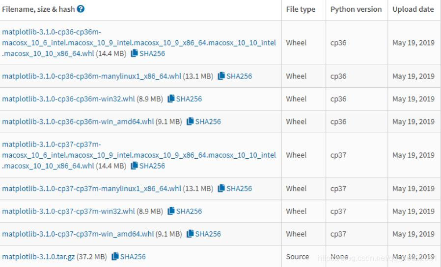  
当读者下载到得到的文件是`matplotlib-3.1.0-cp36-cp36m-win_amd64.whl`，将这个文件保存在`” E:/matp”`目录下。接下来，需要打开一个命令窗口，并切换到`“e:/matp”`目录下。执行如下命令安装`Matplotlib`。

```python
pip install   matplotlib-3.1.0-cp36-cp36m-win_amd64.whl
```

# 为什么要学习Matplotlib

可视化是在整个数据挖掘的关键辅助工具，可以清晰的理解数据，从而调整我们的分析方法。

*   能将数据进行可视化,更直观的呈现
*   使数据更加客观、更具说服力

**例如**：下面两个图为数字展示和图形展示：

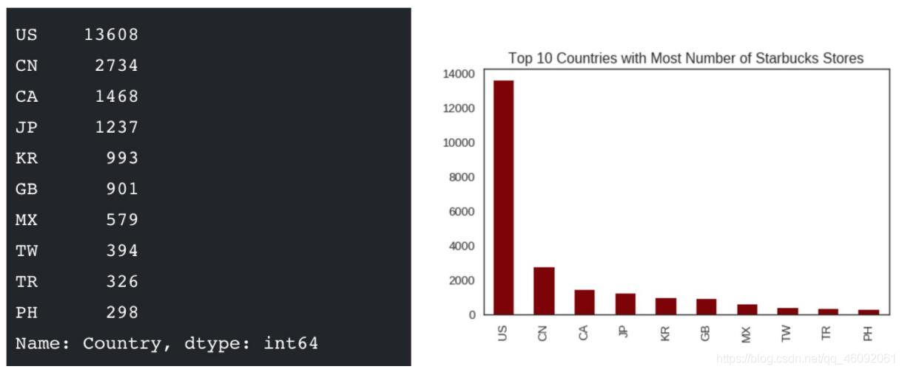

# 绘制基础

在使用**Matplotlib**绘制图形时，其中有两个最为常用的场景。一个是画点，一个是画线。**pyplot**基本方法的使用如下表。

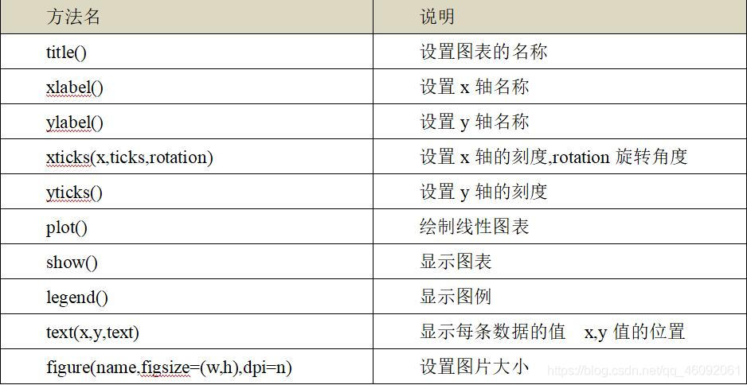  
**matplotlib.pytplot**包含了一系列类似于**matlab**的画图函数。

```python
import matplotlib.pyplot as plt
```

# 图形绘制流程

1.  创建画布 – `plt.figure()`

> plt.figure(figsize=(), dpi=)  
> figsize:指定图的长宽  
> dpi:图像的清晰度  
> 返回fig对象

2.  绘制图像 – `plt.plot(x, y)`
3.  显示图像 – `plt.show()`

# 认识Matplotlib图像结构

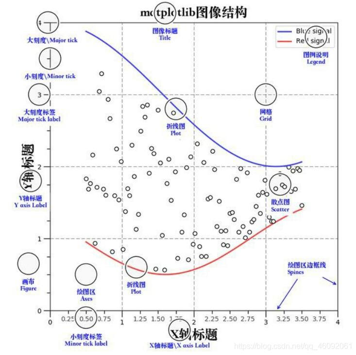

# 实现基础绘图功能

```python
import matplotlib.pyplot as plt
import random
from pylab import mpl
# 设置显示中文字体
mpl.rcParams["font.sans-serif"] = ['SimHei']
# 设置正常显示符号
mpl.rcParams["axes.unicode_minus"] = False

# 0.准备数据
x = range(60)
y = [random.uniform(15, 18) for i in x]  # random.uniform:返回一个随机浮点数 N ，当 a <= b 时 a <= N <= b ，当 b < a 时 b <= N <= a

'''
DPI（Dots Per Inch，每英寸点数）是一个量度单位，用于点阵数码影像，指每一英寸长度中，取样、可显示或输出点的数目。
DPI是打印机、鼠标等设备分辨率的度量单位。是衡量打印机打印精度的主要参数之一，一般来说，DPI值越高，表明打印机的打印精度越高。
'''
# 1.创建画布
plt.figure(figsize=(20, 8), dpi=100)  # 画布大小，dpi：清晰度

# 2.绘制图像
plt.plot(x, y)

# 3.图像显示
plt.show()
```


# 设置标签文字和线条粗细

在上面的实例直线结果不够完美，开发者可以绘制的线条样式进行灵活设置。例如：可以设置线条的粗细、设置文字等。

**绘制折线图并设置样式**

```python
import matplotlib.pyplot as plt
datas=[1,2,3,4,5]
squares=[1,4,9,16,25]
plt.plot(datas,squares,linewidth=5) #设置线条宽度
#设置图标标题，并在坐标轴上添加标签
plt.title('Numbers',fontsize=24)
plt.xlabel('datas',fontsize=14)
plt.ylabel('squares',fontsize=14)
plt.show()
```

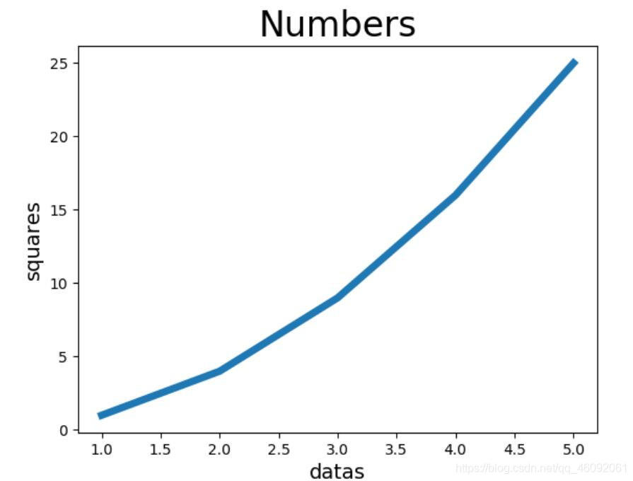

# 解决中文乱码&符号不正常显示

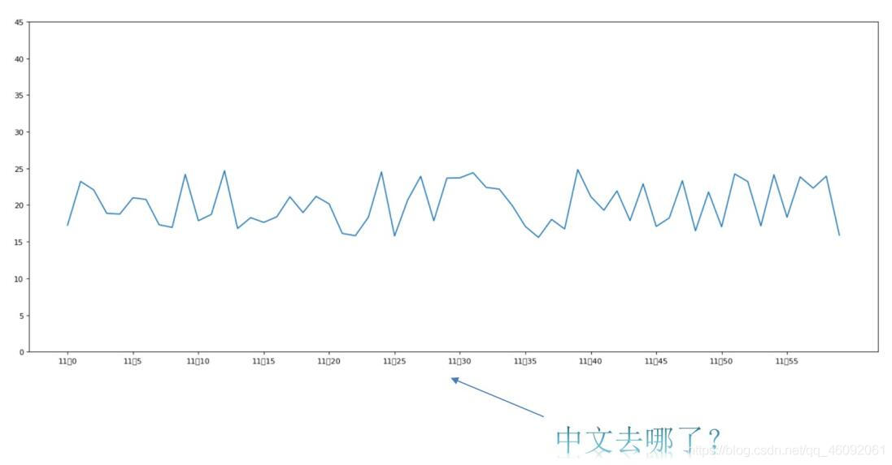  
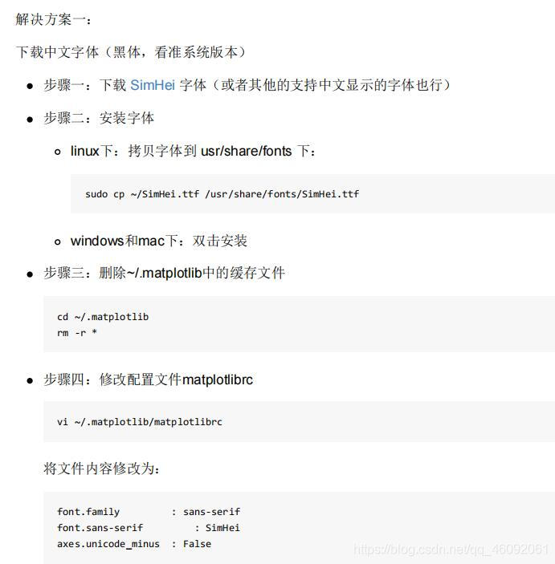

**Matplotlib** 默认情况不支持中文，我们可以使用以下简单的方法来解决：

```python
plt.rcParams['font.sans-serif']=['SimHei'] #用来正常显示中文标签
```

**中文乱码和符号不正常显示：**

```python
from pylab import mpl
# 设置显示中文字体
mpl.rcParams["font.sans-serif"] = ['SimHei']
# 设置正常显示符号
mpl.rcParams["axes.unicode_minus"] = False
```

**解决标签、标题中的中文问题**

```python
import matplotlib.pyplot as plt
datas=[1,2,3,4,5]
squares=[1,4,9,16,25]
plt.plot(datas,squares,linewidth=5) #设置线条宽度
#设置中文乱码问题
plt.rcParams['font.sans-serif'] = ['SimHei']
#设置图标标题，并在坐标轴上添加标签
plt.title('标题设置',fontsize=24)
plt.xlabel('x轴',fontsize=14)
plt.ylabel('y轴',fontsize=14)
plt.show()
```

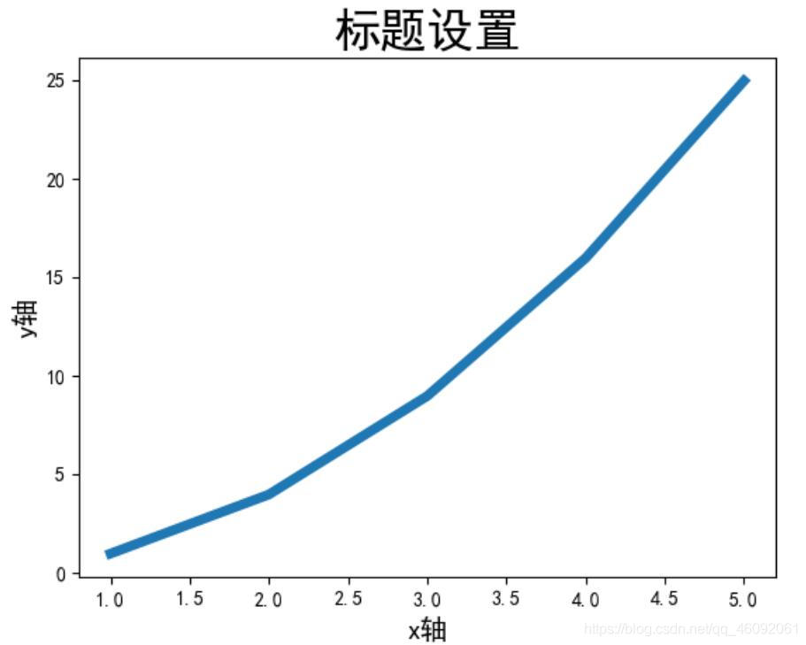

# 绘制直线

在使用**Matplotlib**绘制线性图时，其中最简单的是绘制线图。在下面的实例代码中，使用**Matplotlib**绘制了一个简单的直线。具体实现过程如下：

> （1）导入模块**pyplot**，并给它指定别名plt，以免反复输入pyplot。在模块pyplot中包含很多用于生产图表的函数。  
> （2）将绘制的直线坐标传递给函数**plot**()。  
> （3）通过函数**plt.show**()打开**Matplotlib**查看器，显示绘制的图形。

**根据两点绘制一条线**

```python
import matplotlib.pyplot as plt
#将(0,1)点和(2,4)连起来
plt.plot([0,2],[1,4])
plt.show()
```

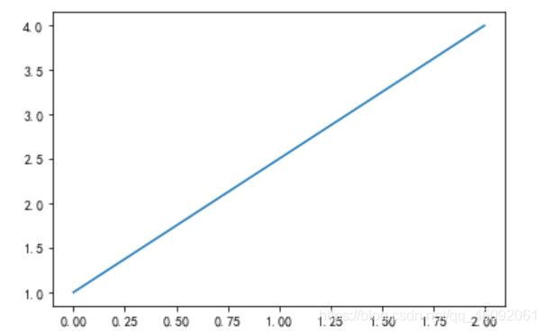

# 绘制折线图

**折线图**：以折线的上升或下降来表示统计数量的增减变化的统计图

**特点**：能够显示数据的变化趋势，反映事物的变化情况。(变化)

api：`plt.plot(x, y)`

在上述的实例代码中，使用两个坐标绘制一条直线，接下来使用平方数序列1、4、9、16和25来绘制一个折线图。

```python
import matplotlib.pyplot as plt
x=[1,2,3,4,5]
squares=[1,4,9,16,25]
plt.plot(x,squares)
plt.show()
```

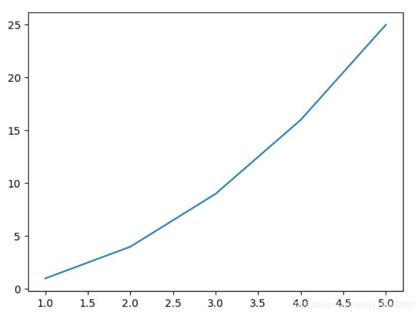  
**举例：展现上海一周的天气,比如从星期一到星期日的天气温度如下:**

```python
import matplotlib.pyplot as plt 
# 1.创建画布 
plt.figure(figsize=(10, 10), dpi=100) 
# 2.绘制折线图 
plt.plot([1, 2, 3, 4, 5, 6 ,7], [17,17,18,15,11,11,13]) 
# 3.显示图像 
plt.show()
```

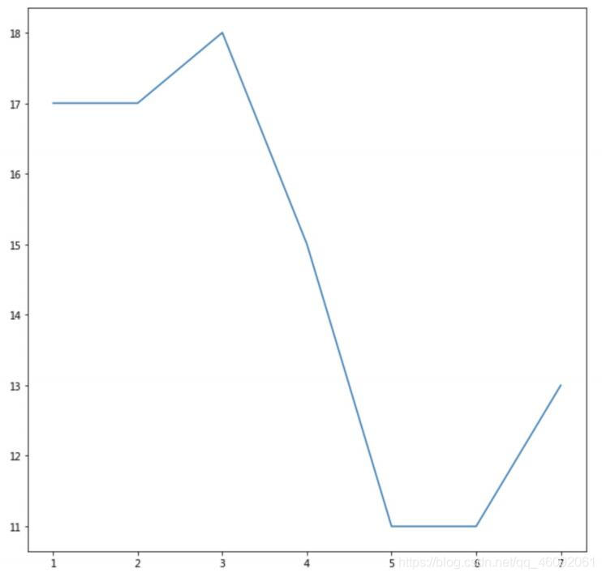  
**举例：正弦曲线**

```python
import numpy as np

# 0. 准备数据
x = np.linspace(-10, 10, 1000)  # 等差数列
y = np.sin(x)  # sin()

# 1. 创建画布
plt.plot(x, y)
# 2.1 添加网格显示
plt.grid(True, linestyle='--', alpha=0.5)
# 2.2 设置标题
plt.title('折线图')

# 3. 显示图像
plt.show()
```

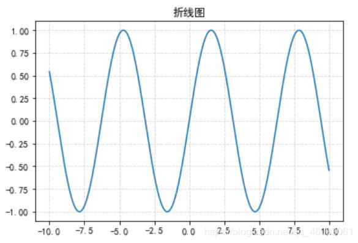

# 折线图案例

**折线图的应用场景**

*   呈现公司产品(不同区域)每天活跃用户数
*   呈现app每天下载数量
*   呈现产品新功能上线后,用户点击次数随时间的变化
*   拓展：画各种数学函数图像
    *   注意：`plt.plot()`除了可以画折线图，也可以用于画各种数学函数图像

为了更好地理解所有基础绘图功能，我们通过天气温度变化的绘图来融合所有的基础API使用 需求：画出某城市11点到12点1小时内每分钟的温度变化折线图，温度范围在15度~18度。

## 准备数据并画出初始折线图

```python
import matplotlib.pyplot as plt
import random
from pylab import mpl
# 设置显示中文字体
mpl.rcParams["font.sans-serif"] = ['SimHei']
# 设置正常显示符号
mpl.rcParams["axes.unicode_minus"] = False

# 0.准备数据
x = range(60)
y = [random.uniform(15, 18) for i in x]  # random.uniform:返回一个随机浮点数 N ，当 a <= b 时 a <= N <= b ，当 b < a 时 b <= N <= a

'''
DPI（Dots Per Inch，每英寸点数）是一个量度单位，用于点阵数码影像，指每一英寸长度中，取样、可显示或输出点的数目。
DPI是打印机、鼠标等设备分辨率的度量单位。是衡量打印机打印精度的主要参数之一，一般来说，DPI值越高，表明打印机的打印精度越高。
'''
# 1.创建画布
plt.figure(figsize=(20, 8), dpi=100)  # 画布大小，dpi：清晰度

# 2.绘制图像
plt.plot(x, y)

# 3.图像显示
plt.show()
```


## 添加自定义x,y刻度

*   plt.xticks(x, \*\*kwargs)
    *   x:要显示的刻度值
*   plt.yticks(y, \*\*kwargs)
    *   y:要显示的刻度值

```python
# 增加以下两行代码 
# 构造x轴刻度标签 
x_ticks_label = ["11点{}分".format(i) for i in x] 
# 构造y轴刻度 
y_ticks = range(40) 
# 修改x,y轴坐标的刻度显示 
plt.xticks(x[::5], x_ticks_label[::5]) 
plt.yticks(y_ticks[::5])
```

## 添加网格显示

为了更加清楚地观察图形对应的值

```python
plt.grid(True, linestyle='--', alpha=0.5)
```

## 添加描述信息

添加x轴、y轴描述信息及标题  
通过`fontsize`参数可以修改图像中字体的大小

```python
plt.xlabel("时间") 
plt.ylabel("温度") 
plt.title("中午11点0分到12点之间的温度变化图示", fontsize=20)
```

## 图像保存

```python
# 保存图片到指定路径 
plt.savefig("test.png")
```

**注意**：`plt.show()`会释放`figure`资源，如果在显示图像之后保存图片将只能保存空图片。

## 完整代码

```python
import matplotlib.pyplot as plt
import random
from pylab import mpl
# 设置显示中文字体
mpl.rcParams["font.sans-serif"] = ['SimHei']
# 设置正常显示符号
mpl.rcParams["axes.unicode_minus"] = False

# 0.准备数据
x = range(60)
y = [random.uniform(15, 18) for i in x]  # random.uniform:返回一个随机浮点数 N ，当 a <= b 时 a <= N <= b ，当 b < a 时 b <= N <= a

'''
DPI（Dots Per Inch，每英寸点数）是一个量度单位，用于点阵数码影像，指每一英寸长度中，取样、可显示或输出点的数目。
DPI是打印机、鼠标等设备分辨率的度量单位。是衡量打印机打印精度的主要参数之一，一般来说，DPI值越高，表明打印机的打印精度越高。
'''
# 1.创建画布
plt.figure(figsize=(20, 8), dpi=100)  # 画布大小，dpi：清晰度

# 2.绘制图像（折线图）
plt.plot(x, y)

# 2.1 添加x，y轴刻度
x_ticks_label = ['11点{}分'.format(i) for i in x]
y_ticks = range(40)

# 修改x，y轴刻度显示
# plt.xticks(x_ticks_label[::5])  坐标刻度不可以直接通过字符串进行修改
# tick：对号; 钩号; 记号
plt.xticks(x[::5], x_ticks_label[::5])  # 先修改为数字刻度，之后替换中文刻度
plt.yticks(y_ticks[::5])

# 2.2 添加网格显示
plt.grid(True, linestyle='--', alpha=0.5)

# 2.3 添加描述信息
plt.xlabel('时间')
plt.ylabel('温度')
plt.title('中午11点-12点某城市温度变化图', fontsize=20)

# 2.4 图像保存（放在show前面，show()会释放figure资源，如果显示图像之后保存图片只能保存空图片）
plt.savefig('./test.png')

# 3.图像显示
plt.show()
```

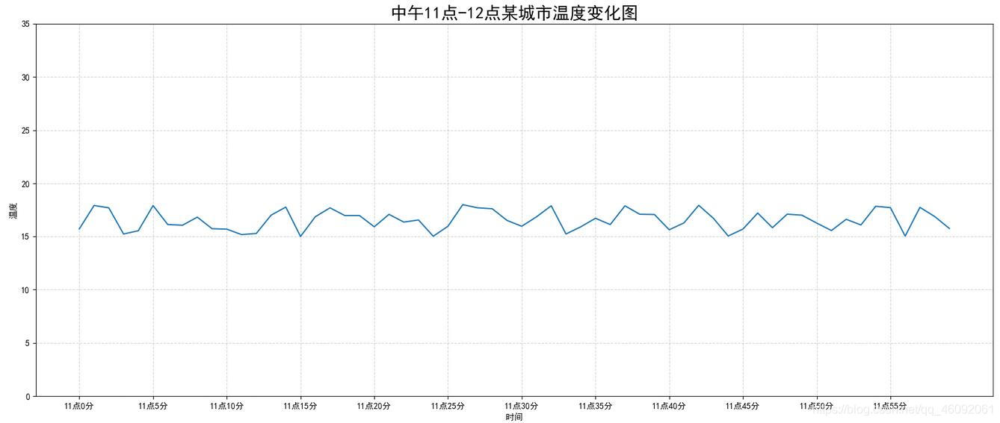

# 在一个坐标系中绘制多个图像

多次`plot`即可

收集到北京当天温度变化情况，温度在1度到3度。怎么去添加另一个在同一坐标系当中的不同图形，其实很简单只需要再次`plot`即可，但是需要区分线条，如下：

```python
# 0.准备数据
x = range(60)
# random.uniform:返回一个随机浮点数 N ，当 a <= b 时 a <= N <= b ，当 b < a 时 b <= N <= a
y_sh = [random.uniform(15, 18) for i in x]
y_bj = [random.uniform(1, 3) for i in x]

'''
DPI（Dots Per Inch，每英寸点数）是一个量度单位，用于点阵数码影像，指每一英寸长度中，取样、可显示或输出点的数目。
DPI是打印机、鼠标等设备分辨率的度量单位。是衡量打印机打印精度的主要参数之一，一般来说，DPI值越高，表明打印机的打印精度越高。
'''
# 1.创建画布
plt.figure(figsize=(20, 8), dpi=100)  # 画布大小，dpi：清晰度

# 2.绘制图像（折线图）
plt.plot(x, y_sh, label='上海')
# 设置线的风格，颜色，添加图例
plt.plot(x, y_bj, color='r', linestyle='--', label='北京')

# 2.1 添加x，y轴刻度
x_ticks_label = ['11点{}分'.format(i) for i in x]
y_ticks = range(40)

# 修改x，y轴刻度显示
# plt.xticks(x_ticks_label[::5])  坐标刻度不可以直接通过字符串进行修改
# tick：对号; 钩号; 记号
plt.xticks(x[::5], x_ticks_label[::5])  # 先修改为数字刻度，之后替换中文刻度
plt.yticks(y_ticks[::5])

# 2.2 添加网格显示
plt.grid(True, linestyle='--', alpha=0.5)

# 2.3 添加描述信息
plt.xlabel('时间')
plt.ylabel('温度')
plt.title('中午11点-12点某城市温度变化图', fontsize=20)

# 2.4 图像保存（放在show前面，show()会释放figure资源，如果显示图像之后保存图片只能保存空图片）
# plt.savefig('./test.png')

# 2.5 显示图例
plt.legend(loc="best")  # 0

# 3.图像显示
plt.show()
```

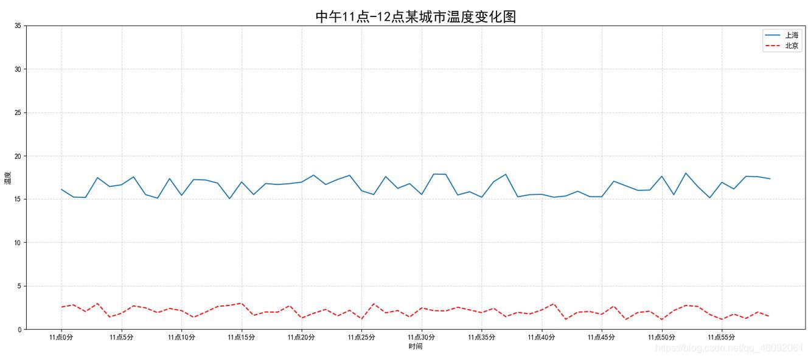  
我们仔细观察，用到了两个新的地方，一个是对于不同的折线展示效果，一个是添加图例。

# 显示图例

注意：如果只在`plt.plot()`中设置`label`还不能最终显示出图例，还需要通过`plt.legend()`将图例显示出来。

```python
# 绘制折线图 
plt.plot(x, y_shanghai, label="上海") 
# 使用多次plot可以画多个折线 
plt.plot(x, y_beijing, color='r', linestyle='--', label="北京") 
# 显示图例 
plt.legend(loc="best")
```

参数 `loc`：

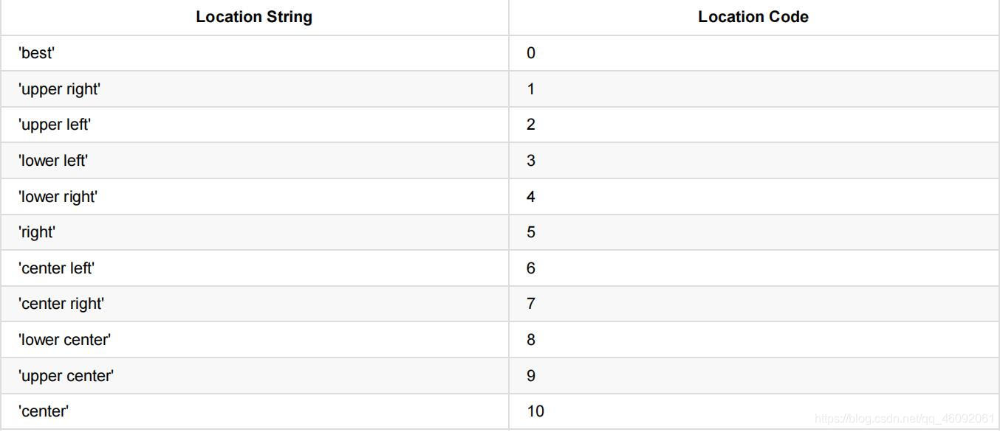

# 多个坐标系实现绘图

多个坐标系显示—`plt.subplots`(面向对象的画图方法)

可以通过`subplots`函数实现(旧的版本中有`subplot`，使用起来不方便)，推荐`subplots`函数

`matplotlib.pyplot.subplots(nrows=1, ncols=1, **fig_kw)`创建一个带有多个`axes`(坐标系/绘图区)的图：

```python
Parameters: 
	nrows, ncols : 设置有几行几列坐标系 
		int, optional, default: 1, Number of rows/columns of the subplot grid. 
	Returns: 
	fig : 图对象 
	axes : 返回相应数量的坐标系 

	设置标题等方法不同： 
	set_xticks 
	set_yticks 
	set_xlabel 
	set_ylabel
```

关于`axes`子坐标系的更多方法：请参考：  
`https://matplotlib.org/api/axes_api.html#matplotlib.axes.Axes`

**注意**：`plt.函数名()`相当于`面向过程`的画图方法，`axes.set_方法名()`相当于`面向对象`的画图方法。

```python
# 0.准备数据
x = range(60)
# random.uniform:返回一个随机浮点数 N ，当 a <= b 时 a <= N <= b ，当 b < a 时 b <= N <= a
y_sh = [random.uniform(15, 18) for i in x]
y_bj = [random.uniform(1, 3) for i in x]

'''
DPI（Dots Per Inch，每英寸点数）是一个量度单位，用于点阵数码影像，指每一英寸长度中，取样、可显示或输出点的数目。
DPI是打印机、鼠标等设备分辨率的度量单位。是衡量打印机打印精度的主要参数之一，一般来说，DPI值越高，表明打印机的打印精度越高。
'''
# 1.创建画布
# plt.figure(figsize=(20, 8), dpi=100)  # 画布大小，dpi：清晰度
fig, axes = plt.subplots(nrows=1, ncols=2, figsize=(
    20, 8), dpi=100)  # 画布fig对象，区域axes对象（）

# 2.绘制图像（折线图）
# plt.plot(x, y_sh, label='上海')
# # 设置线的风格，颜色，添加图例
# plt.plot(x, y_bj, color='r', linestyle='--', label='北京')
axes[0].plot(x, y_sh, label='上海')
# 设置线的风格，颜色，添加图例
axes[1].plot(x, y_bj, color='r', linestyle='--', label='北京')

# 2.1 添加x，y轴刻度
x_ticks_label = ['11点{}分'.format(i) for i in x]
y_ticks = range(40)

# 修改x，y轴刻度显示
# plt.xticks(x_ticks_label[::5])  坐标刻度不可以直接通过字符串进行修改
# tick：对号; 钩号; 记号
# plt.xticks(x[::5], x_ticks_label[::5])  # 先修改为数字刻度，之后替换中文刻度
# plt.yticks(y_ticks[::5])
axes[0].set_xticks(x[::5])
axes[0].set_yticks(y[::5])
axes[0].set_xticklabels(x_ticks_label[::5])
axes[1].set_xticks(x[::5])
axes[1].set_yticks(y[::5])
axes[1].set_xticklabels(x_ticks_label[::5])

# 2.2 添加网格显示
# plt.grid(True, linestyle='--', alpha=0.5)
axes[0].grid(True, linestyle='--', alpha=0.5)
axes[1].grid(True, linestyle='--', alpha=0.5)

# 2.3 添加描述信息
# plt.xlabel('时间')
# plt.ylabel('温度')
# plt.title('中午11点-12点某城市温度变化图', fontsize=20)
axes[0].set_xlabel('时间')
axes[0].set_ylabel('温度')
axes[0].set_title('中午11点-12点某城市温度变化图', fontsize=20)
axes[1].set_xlabel('时间')
axes[1].set_ylabel('温度')
axes[1].set_title('中午11点-12点某城市温度变化图', fontsize=20)

# 2.4 图像保存（放在show前面，show()会释放figure资源，如果显示图像之后保存图片只能保存空图片）
plt.savefig('./test.png')

# 2.5 显示图例
# plt.legend(loc="best")  # 0
axes[0].legend(loc=0)
axes[1].legend(loc=0)

# 3.图像显示
plt.show()
```

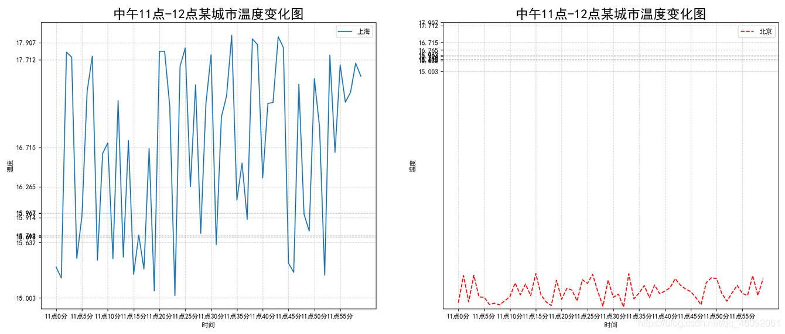

# 绘制一元二次方程的曲线y=x^2

**Matplotlib**有很多函数用于绘制各种图形，其中**plot**函数用于曲线，需要将200个点的x坐标和Y坐标分别以序列的形式传入plot函数，然后调用`show`函数显示绘制的图形。一元二次方程的曲线

**一元二次方程的曲线**

```python
import matplotlib.pyplot as plt
#200个点的x坐标
x=range(-100,100)
#生成y点的坐标
y=[i**2 for i in x ]
#绘制一元二次曲线
plt.plot(x,y)
#调用savefig将一元二次曲线保存为result.jpg
plt.savefig('result.jpg') #如果直接写成 plt.savefig('cos') 会生成cos.png
plt.show()
```

> 调用**savefig**()将一元二次曲线保存为result.jpg

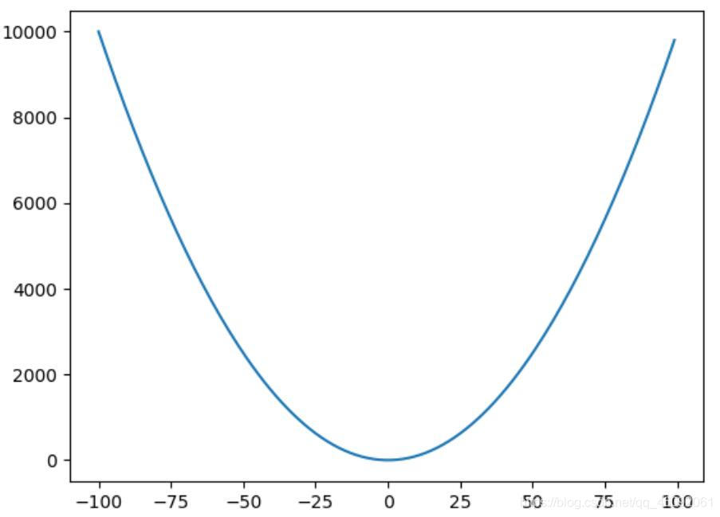

# 绘制正弦曲线和余弦曲线

使用`plt`函数绘制任何曲线的第一步都是生成若干个坐标点（x,y），理论上坐标点是越多越好。本例取0到10之间100个等差数作为x的坐标，然后将这100个x坐标值一起传入`Numpy`的`sin`和`cos`函数，就会得到100个y坐标值，最后就可以使用`plot`函数绘制正弦曲线和余弦曲线。

**正弦曲线和余弦曲线**

```python
import matplotlib.pyplot as plt
import numpy as np
#生成x的坐标（0-10的100个等差数列）
x=np.linspace(0,10,100)
sin_y=np.sin(x)
#绘制正弦曲线
plt.plot(x,sin_y)
#绘制余弦曲线
cos_y=np.cos(x)
plt.plot(x,cos_y)
plt.show()
```

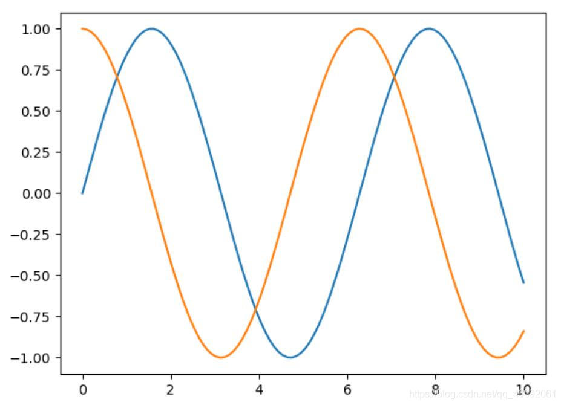  
上面的示例可以看到，调用两次`plot`函数，会将`sin`和`cos`曲线绘制到同一个二维坐标系中，如果想绘制到两张画布中，可以调用`subplot()`函数将画布分区。

**将画布分为区域，将图画到画布的指定区域**

```python
import matplotlib.pyplot as plt
import numpy as np
#将画布分为区域，将图画到画布的指定区域
x=np.linspace(1,10,100)
#将画布分为2行2列，将图画到画布的1区域
plt.subplot(2,2,1)
plt.plot(x,np.sin(x))
plt.subplot(2,2,3)
plt.plot(x,np.cos(x))
plt.show()
```

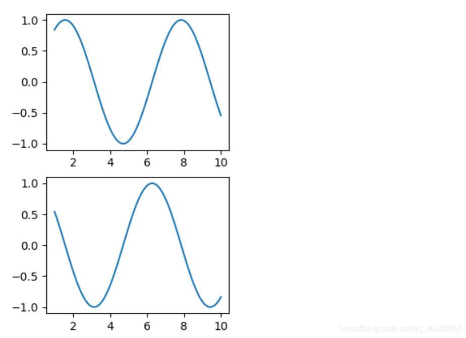

# 绘制散点图

**散点图**：用两组数据构成多个坐标点，考察坐标点的分布,判断两变量之间是否存在某种关联或总结坐标点的分布模式。

**特点**：判断变量之间是否存在数量关联趋势,展示离群点(分布规律)

api：`plt.scatter(x, y)`

使用`scatter`函数可以绘制随机点，该函数需要接收x坐标和y坐标的序列。

**sin函数的散点图**

```python
import matplotlib.pyplot as plt
import numpy as np
#画散点图
x=np.linspace(0,10,100)#生成0到10中100个等差数
plt.scatter(x,np.sin(x))
plt.show()
```

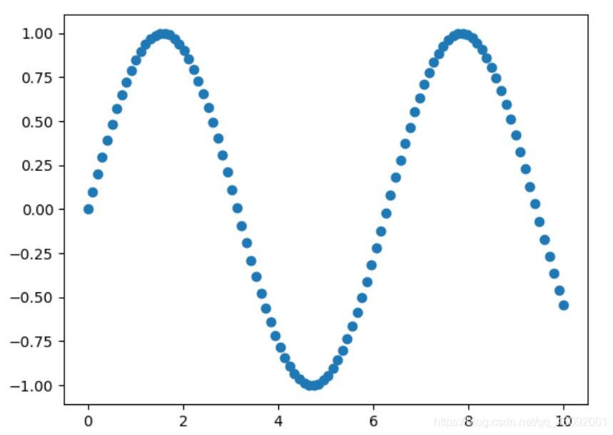  
**使用scatter画10种大小100种颜色的散点图**

```python
import matplotlib.pyplot as plt
import numpy as np
# 画10种大小， 100种颜色的散点图
np.random.seed(0)
x=np.random.rand(100)
y=np.random.rand(100)
colors=np.random.rand(100)
size=np.random.rand(10)*1000
plt.scatter(x,y,c=colors,s=size,alpha=0.7)
plt.show()
```

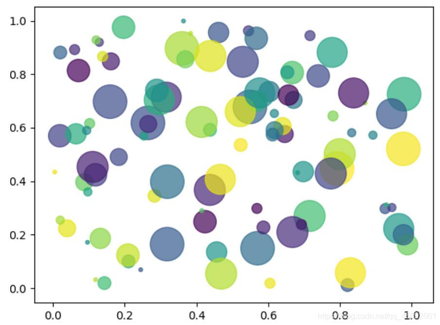

**散点图绘制举例：**

**需求**：探究房屋面积和房屋价格的关系

```python
import matplotlib.pyplot as plt

from pylab import mpl
# 设置显示中文字体
mpl.rcParams["font.sans-serif"] = ['SimHei']
# 设置正常显示符号
mpl.rcParams["axes.unicode_minus"] = False

# 0.准备数据 
x = [225.98, 247.07, 253.14, 457.85, 241.58, 301.01, 20.67, 288.64, 
     163.56, 120.06, 207.83, 342.75, 147.9 , 53.06, 224.72, 29.51, 21.61, 483.21, 245.25, 399.25, 343.35] 
y = [196.63, 203.88, 210.75, 372.74, 202.41, 247.61, 24.9 , 239.34, 
     140.32, 104.15, 176.84, 288.23, 128.79, 49.64, 191.74, 33.1 , 30.74, 400.02, 205.35, 330.64, 283.45]

# 1. 创建画布
plt.figure(figsize=(20, 8), dpi=100)

# 2. 绘制图像
plt.scatter(x, y)
# 设置x轴刻度
plt.xticks(range(500)[::50])
# 添加网格
plt.grid()

# 3. 图像显示
plt.show()
```

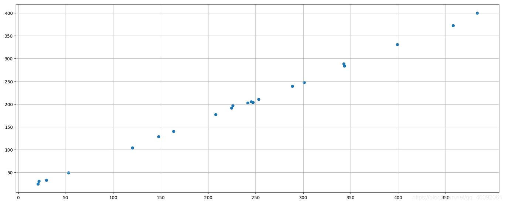

# 格式化字符

作为线性图的替代，可以通过向 `plot()` 函数添加格式字符串来显示离散值。 可以使用以下格式化字符。

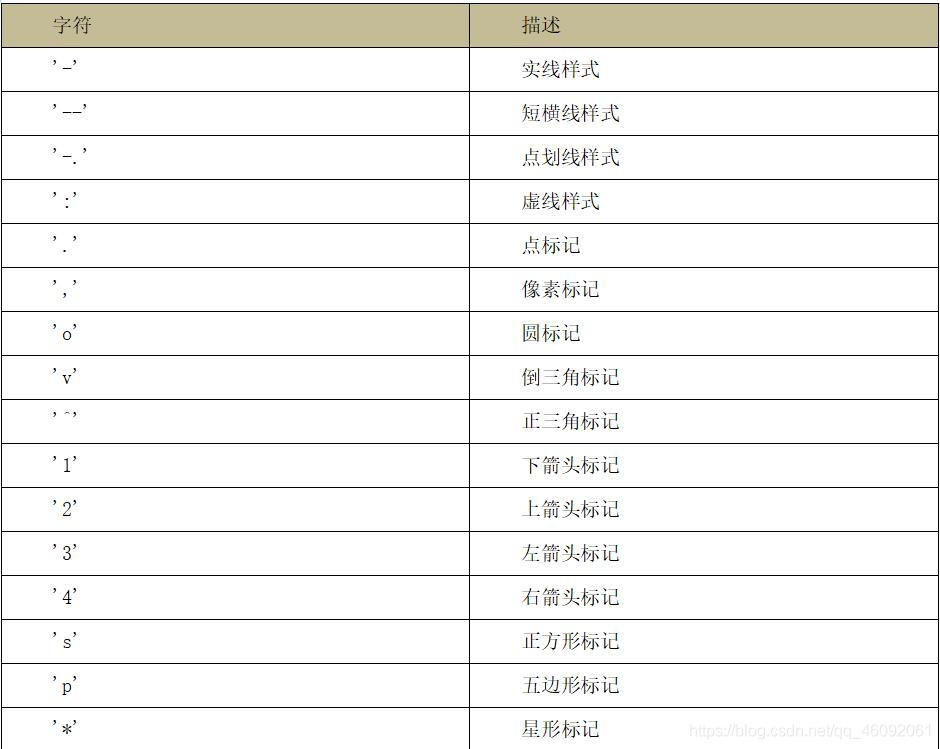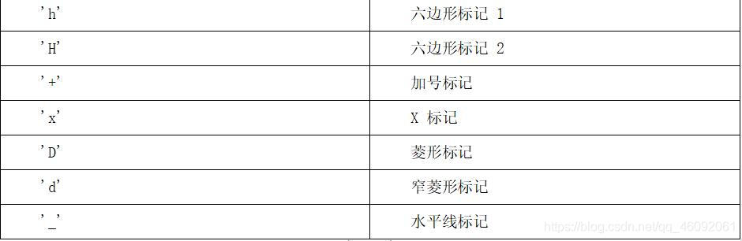

**以下是颜色的缩写：**

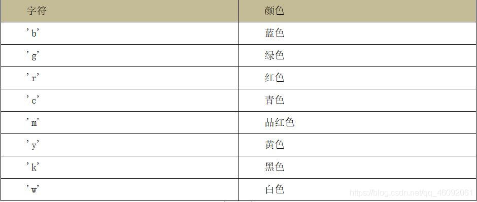  
**不同种类不同颜色的线**

```python
#不同种类不同颜色的线
x=np.linspace(0,10,100)
plt.plot(x,x+0,'-g')    #实线  绿色
plt.plot(x,x+1,'--c')   #虚线 浅蓝色
plt.plot(x,x+2,'-.k')   #点划线 黑色
plt.plot(x,x+3,'-r')    #实线  红色
plt.plot(x,x+4,'o')     #点   默认是蓝色
plt.plot(x,x+5,'x')     #叉叉  默认是蓝色
plt.plot(x,x+6,'d')    #砖石  红色
```

**不同种类不同颜色的线并添加图例**

```python
#不同种类不同颜色的线并添加图例
x=np.linspace(0,10,100)
plt.plot(x,x+0,'-g',label='-g')    #实线  绿色
plt.plot(x,x+1,'--c',label='--c')   #虚线 浅蓝色
plt.plot(x,x+2,'-.k',label='-.k')   #点划线 黑色
plt.plot(x,x+3,'-r',label='-r')    #实线  红色
plt.plot(x,x+4,'o',label='o')     #点   默认是蓝色
plt.plot(x,x+5,'x',label='x')     #叉叉  默认是蓝色
plt.plot(x,x+6,'dr',label='dr')    #砖石  红色
#添加图例右下角lower right  左上角upper left 边框  透明度  阴影  边框宽度
plt.legend(loc='lower right',fancybox=True,framealpha=1,shadow=True,borderpad=1)
plt.show()
```

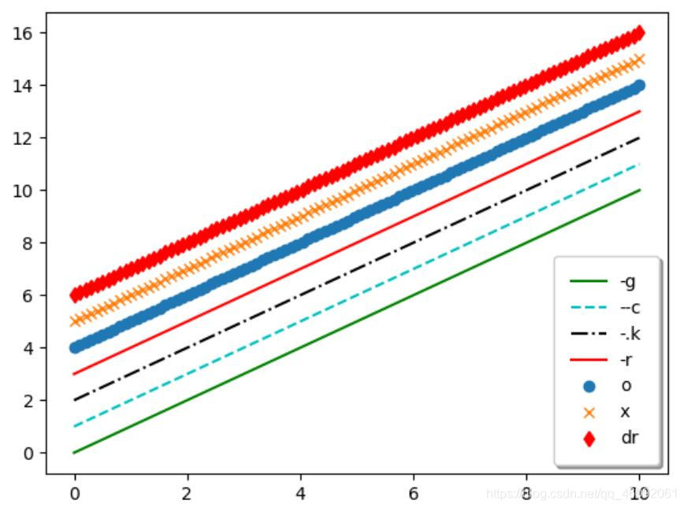

# 绘制柱状图

**柱状图**：排列在工作表的列或行中的数据可以绘制到柱状图中。

**特点**：绘制连离散的数据,能够一眼看出各个数据的大小,比较数据之间的差别。(统计/对比)

api：`plt.bar(x, width, align='center', **kwargs)`

```python
Parameters: 
x : 需要传递的数据

width : 柱状图的宽度 
align : 每个柱状图的位置对齐方式 
	{‘center’, ‘edge’}, optional, default: ‘center’ 

**kwargs : 
color:选择柱状图的颜色
```

使用`bar`函数可以绘制柱状图。柱状图需要水平的x坐标值，以及每一个x坐标值对应的y坐标值，从而形成柱状的图。柱状图主要用来纵向对比和横向对比的。例如，根据年份对销售收据进行纵向对比，x坐标值就表示年份，y坐标值表示销售数据。

**使用bar绘制柱状图，并设置柱的宽度**

```python
import matplotlib.pyplot as plt
import numpy as np
x=[1980,1985,1990,1995]
x_labels=['1980年','1985年','1990年','1995年']
y=[1000,3000,4000,5000]
plt.bar(x,y,width=3)
plt.rcParams['font.sans-serif']=['SimHei'] #用来正常显示中文标签
plt.xticks(x,x_labels)
plt.xlabel('年份')
plt.ylabel('销量')
plt.title('根据年份销量对比图')
plt.show()
```

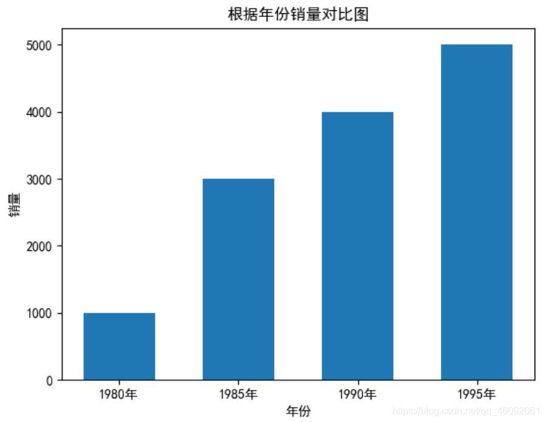  
需要注意的是`bar`函数的宽度并不是像素宽度。bar函数会根据二维坐标系的尺寸，以及x坐标值的多少，自动确定每一个柱的宽度，而`width`指定的宽度就是这个**标准柱宽度**的倍数。该参数值可以是浮点数，如0.5，表示柱的宽度是标准宽度的0.5倍。

**使用bar和barh绘制柱状图**

```python
import matplotlib.pyplot as plt
import numpy as np
np.random.seed(0)
x=np.arange(5)
y=np.random.randint(-5,5,5)
print(x,y)
# 将画布分隔成一行两列
plt.subplot(1,2,1)
#在第一列中画图
v_bar=plt.bar(x,y)
#在第一列的画布中 0位置画一条蓝线
plt.axhline(0,color='blue',linewidth=2)
plt.subplot(1,2,2)
#barh将y和x轴对换 竖着方向为x轴
h_bar=plt.barh(x,y,color='red')
#在第二列的画布中0位置处画红色的线
plt.axvline(0,color='red',linewidth=2)
plt.show()
```

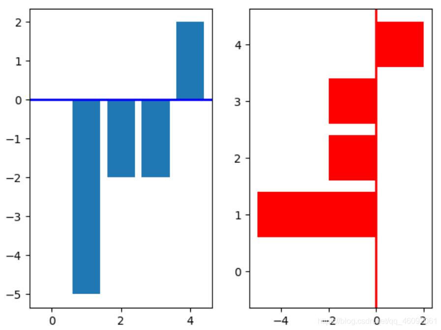  
**对部分柱状图，使用颜色区分**

```python
import matplotlib.pyplot as plt
import numpy as np
np.random.seed(0)
x=np.arange(5)
y=np.random.randint(-5,5,5)
v_bar=plt.bar(x,y,color='lightblue')
for bar,height in zip(v_bar,y):
    if height<0:
        bar.set(edgecolor='darkred',color='lightgreen',linewidth='3')
plt.show()
```

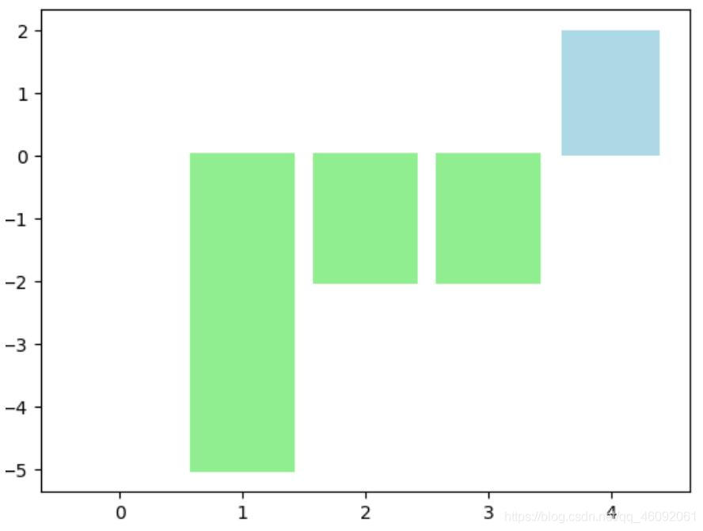  
**柱状图使用实例**

**电影票房柱状图绘制1：**

```python
import matplotlib.pyplot as plt
import numpy as np
#三天中三部电影的票房变化
real_names=['千与千寻','玩具总动员4','黑衣人：全球追缉']
real_num1=[5453,7548,6543]
real_num2=[1840,4013,3421]
real_num3=[1080,1673,2342]
#生成x  第1天   第2天   第3天
x=np.arange(len(real_names))
x_label=['第{}天'.format(i+1) for i in range(len(real_names))]
#绘制柱状图
#设置柱的宽度
width=0.3
plt.bar(x,real_num1,color='g',width=width,label=real_names[0])
plt.bar([i+width for i in x],real_num2,color='b',width=width,label=real_names[1])
plt.bar([i+2*width for i in x],real_num3,color='r',width=width,label=real_names[2])
plt.rcParams['font.sans-serif']=['SimHei'] #用来正常显示中文标签
#修改x坐标
plt.xticks([i+width for i in x],x_label)
#添加图例
plt.legend()
#添加标题
plt.title('3天的票房数')
plt.show()
```

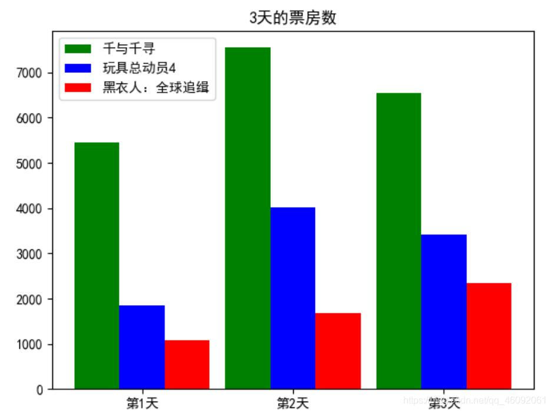

**电影票房柱状图绘制2：**

**需求**：对比每部电影的票房收入.

电影数据如下图所示：

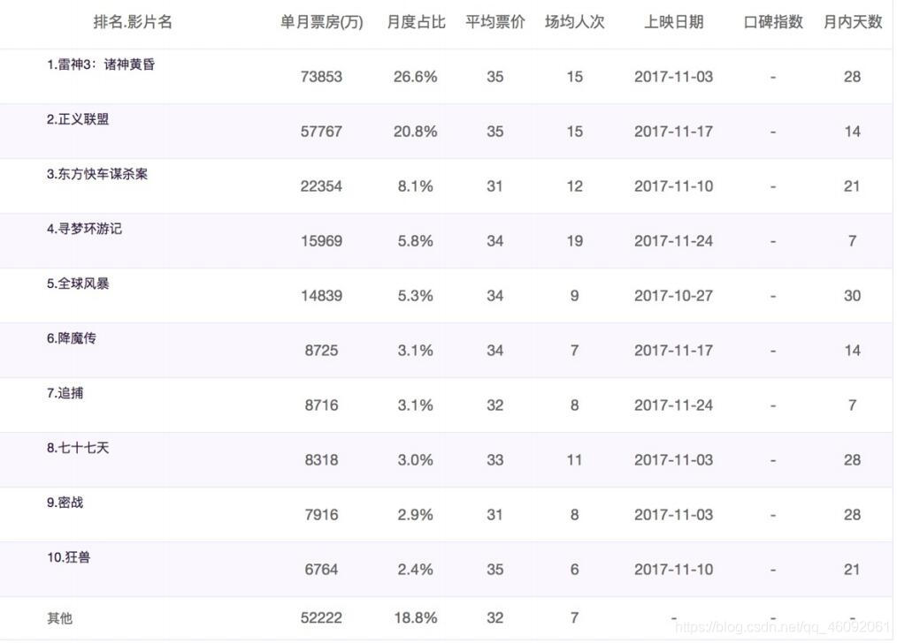

```python
# 0.准备数据 
# 电影名字 
movie_name = ['雷神3：诸神黄昏','正义联盟','东方快车谋杀案','寻梦环游记','全球风暴','降魔传','追捕','七十七天','密战','狂兽','其它']
# 横坐标 
x = range(len(movie_name)) 
# 票房数据 
y = [73853,57767,22354,15969,14839,8725,8716,8318,7916,6764,52222]

# 1. 创建画布
plt.figure(figsize=(20, 8), dpi=100)

# 2. 绘制柱状图
plt.bar(x, y, width=0.5, color=['b','r','g','y','c','m','y','k','c','g','b'])

# 2.1 修改x轴刻度显示
plt.xticks(x, movie_name)

# 2.2 添加网格
plt.grid(linestyle='--', alpha=0.8)

# 2.3 添加标题
plt.title('电影票房收入对比', fontsize=20)

# 3.图像显示
plt.show()
```

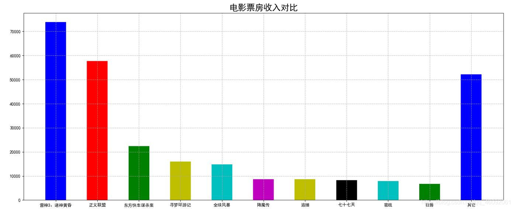

# 绘制饼状图

**饼图**：用于表示不同分类的占比情况，通过弧度大小来对比各种分类。

**特点**：分类数据的占比情况(占比)

api：`plt.pie(x, labels=,autopct=,colors)`

```python
Parameters: 
x:数量，自动算百分比 
labels:每部分名称 
autopct:占比显示指定%1.2f%% 
colors:每部分颜色
```

`pie`函数可以绘制饼状图，饼图主要是用来呈现比例的。只要传入比例数据即可。

**绘制饼状图**

```python
#导入模块
import matplotlib.pyplot as plt
import numpy as np
#准备男、女的人数及比例
man=71351
woman=68187
man_perc=man/(woman+man)
woman_perc=woman/(woman+man)
#添加名称
labels=['男','女']
#添加颜色
colors=['blue','red']
#绘制饼状图  pie
plt.rcParams['font.sans-serif']=['SimHei'] #用来正常显示中文标签
# labels 名称 colors：颜色，explode=分裂  autopct显示百分比
paches,texts,autotexts=plt.pie([man_perc,woman_perc],labels=labels,colors=colors,explode=(0,0.05),autopct='%0.1f%%')

#设置饼状图中的字体颜色
for text in autotexts:
    text.set_color('white')

#设置字体大小
for text in texts+autotexts:
    text.set_fontsize(20)
plt.show()
```

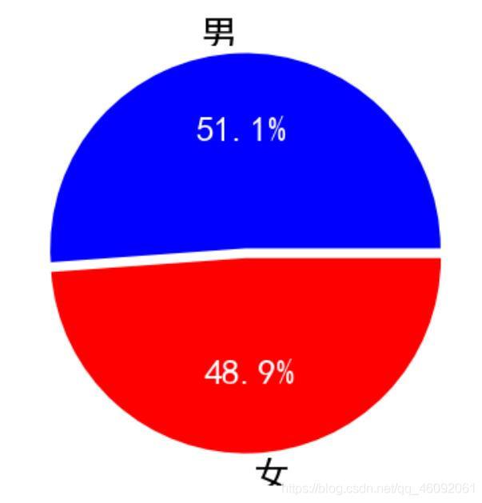

# 绘制直方图

**直方图**：由一系列高度不等的纵向条纹或线段表示数据分布的情况。 一般用横轴表示数据范围，纵轴表示分布情况。

**特点**：绘制连续性的数据展示一组或者多组数据的分布状况(统计)

api：`matplotlib.pyplot.hist(x, bins=None)`

```python
Parameters: 
x : 需要传递的数据 
bins : 组距
```

**直方图**与**柱状图**的风格类似，都是由若干个柱组成，但直方图和柱状图的含义却有很大的差异。直方图是用来观察分布状态的，而柱状图是用来看每一个X坐标对应的Y的值的。也就是说，直方图关注的是分布，并不关心具体的某个值，而柱状图关心的是具体的某个值。使用`hist`函数绘制直方图。

**使用randn函数生成1000个正态分布的随机数，使用hist函数绘制这1000个随机数的分布状态**

```python
import numpy as np
import matplotlib.pyplot as plt
#频次直方图，均匀分布
#正太分布
x=np.random.randn(1000)
#画正太分布图
# plt.hist(x)
plt.hist(x,bins=100) #装箱的操作，将10个柱装到一起及修改柱的宽度
```

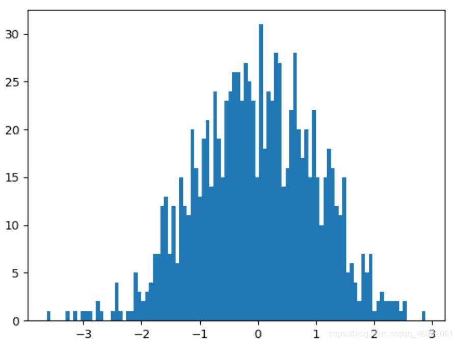  
**使用normal函数生成1000个正态分布的随机数，使用hist函数绘制这100个随机数的分布状态**

```python
import numpy as np
import matplotlib.pyplot as plt
#几个直方图画到一个画布中,第一个参数期望  第二个均值
x1=np.random.normal(0,0.8,1000)
x2=np.random.normal(-2,1,1000)
x3=np.random.normal(3,2,1000)
#参数分别是bins：装箱，alpha：透明度
kwargs=dict(bins=100,alpha=0.4)  # 字典，作为传参使用
plt.hist(x1,**kwargs)
plt.hist(x2,**kwargs)
plt.hist(x3,**kwargs)
plt.show()
```

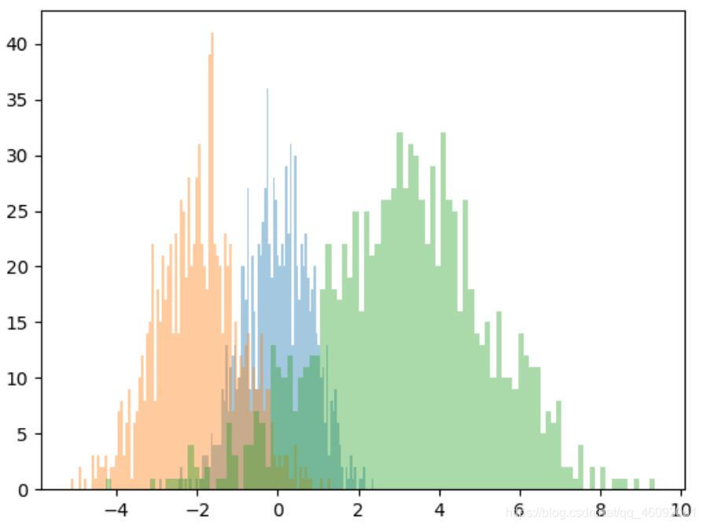

# 绘制等高线图

使用`pyplot`绘制等高线图

```python
#导入模块
import matplotlib.pyplot as plt
import numpy as npaa
x=np.linspace(-10,10,100)
y=np.linspace(-10,10,100)
#计算x和y的相交点a
X,Y=np.meshgrid(x,y)
# 计算Z的坐标
Z=np.sqrt(X**2+Y**2)
plt.contourf(X,Y,Z)
plt.contour(X,Y,Z)
# 颜色越深表示值越小，中间的黑色表示z=0.

plt.show()
```

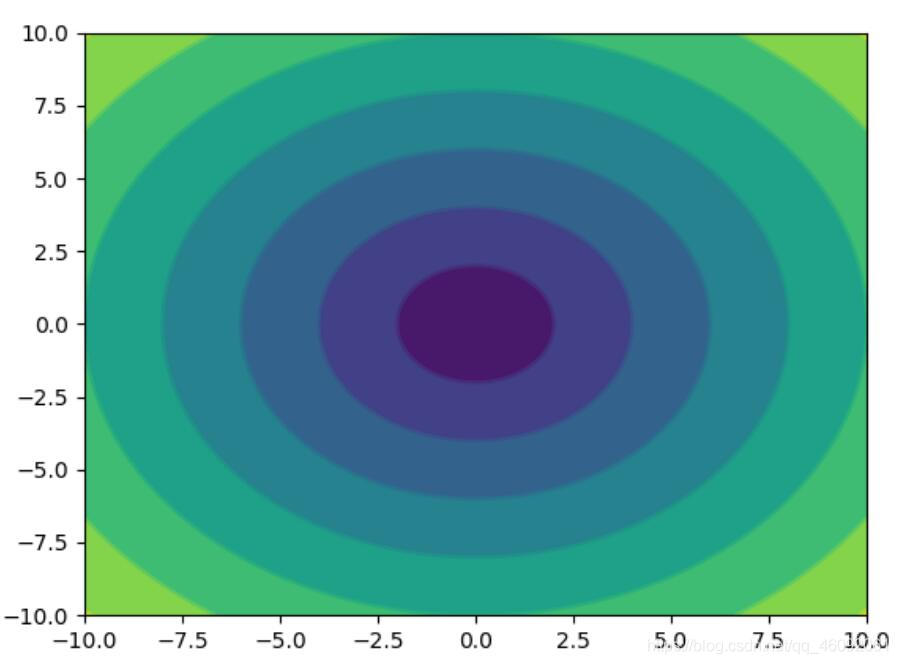

# 绘制三维图

使用`pyplot`包和`Matplotlib`绘制三维图。

```python
import matplotlib.pyplot as plt
#导入3D包
from mpl_toolkits.mplot3d import Axes3D
#创建X、Y、Z坐标
X=[1,1,2,2]
Y=[3,4,4,3]
Z=[1,100,1,1]
# 创建画布
fig = plt.figure()
# 创建了一个Axes3D的子图放到figure画布里面
ax = Axes3D(fig)
ax.plot_trisurf(X, Y, Z)
plt.show()
```

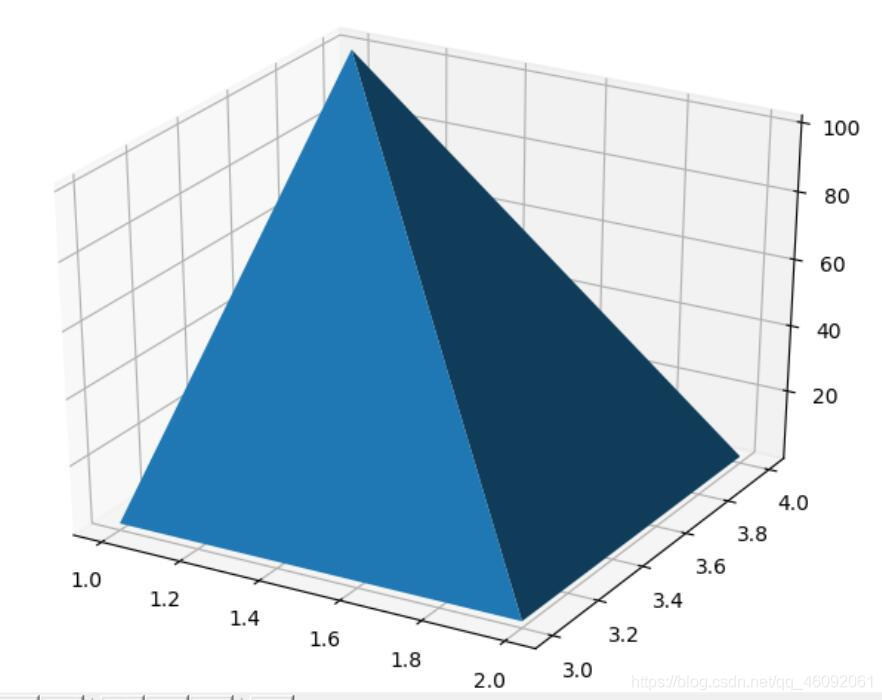

# 总结

参考链接：`https://matplotlib.org/index.html`

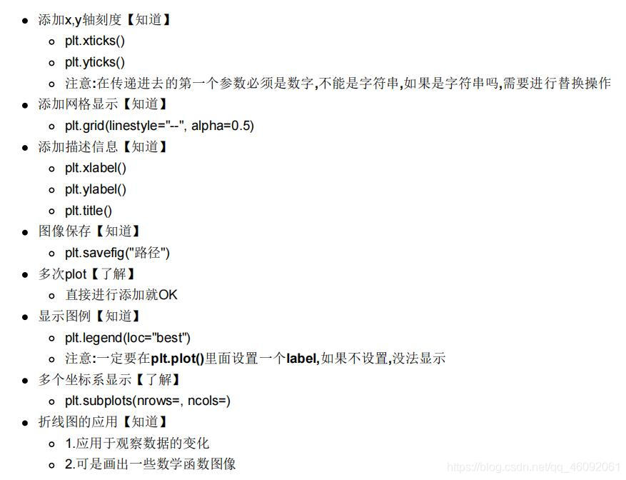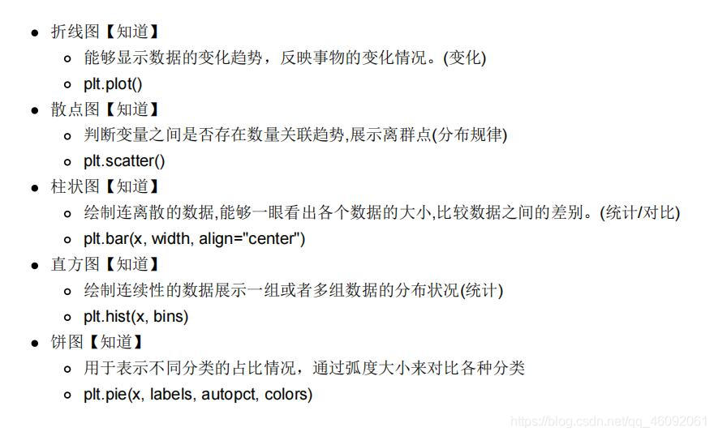

**感谢！**

**努力！**

**加油！**