# Transformer深度剖析 

## 导读

Transformer在许多的人工智能领域，如自然语言处理(Natural Language Processing, NLP)、计算机视觉(Computer Vision, CV)和语音处理(Speech Processing, SP)取得了巨大的成功。因此，自然而然的也吸引了许多工业界和学术界的研究人员的兴趣。到目前为止，已经提出了大量基于Transformer的相关工作和综述。本文基于**邱锡鹏\[1\]**老师近日所发表的一篇**综述\[2\]**为基础，详细的解读Transformer的来龙去脉，同时为大家介绍近期一些相关工作，中间也会穿插一些笔者的见解。最后，本文也将列出一些可探索的未来研究方向，希望能给予读者一些启发。

## **背景**

**Transformer\[3\]**最早提出是被作为一种序列到序列(sequence-to-sequence)模型并应用于机器翻译的。之后的一些工作表明基于Transformer的预训练模型可以在不同的任务上实现SOTA(Satte-Of-The-Art)性能。

基于Transformer的巨大成功，在过去的几年里也相继提出了一系列的Transformer变体，简称X-formers。这些变体主要从不同的角度对Transformer进行了相应的改进。（有点当年ResNet和UNet的味道啊，哈哈哈）

*   **模型效率**。为了捕获长距离依赖关系，Transformer应用了自注意力机制来建模全局的上下文信息，然而这种基于像素点(pixel-to-pixel)对的建模方式**计算量**无疑是巨大的，通常为输入特征尺寸的二次方。改进的方法包括两种思路，即轻量化的注意力（譬如稀疏注意力变体）和分治法（譬如循环和分层机制）。
*   **模型泛化性**。由于Transormer是一种十分灵活的架构，而且其对输入数据的结构性偏差几乎是没有假设的，因此也很难应用在小规模数据集上进行训练，也就是说缺乏泛化性能。改进方案包括引入结构性偏差或正则化技术，以及对大规模未标记数据进行预训练等。
*   **模型自适应**。这一类型的工作旨在将Transformer应用到特定的下游任务和应用。

### **Vanilla Transformer**

原生的Transformer模型是一个由**编码器**和**解码器**组成的序列到序列模型，其中编解码器均堆叠了L个相同的块。每一个编码器主要由多头注意力(**Multi-head Self-Attention, MSA**)模块和position-wise的前向传播网络(**Feed-Forward Network, FFN**)组成。为了构建一个更深的模型，每一个模块都应用了残差连接，后面紧跟一个**层归一化\[4\]**(**Layer Normalization, LN**)模块。相比于编码器来说，解码器在MSA模块和FFN模块之间额外插入了一个交叉注意力(**Cross-Attention, CA**)模块。此外，解码器端的自注意力模块作用是用于避免当前位置关注到后续位置的信息。网络的整体结构如下图所示：

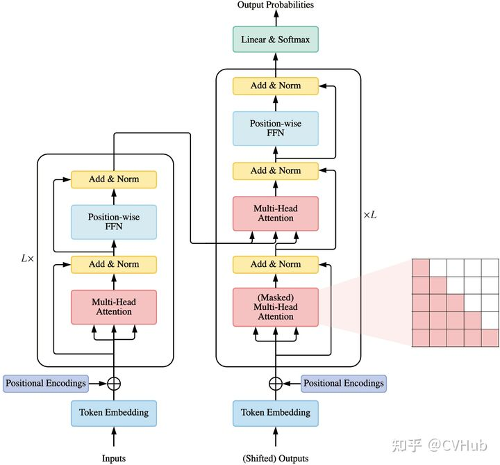

### **注意力模块**

Transformer采用了带有**Query-Key-Value**(QKV)的自注意力模块。其中，Q指的是查询向量，K指的是关键字向量，而V指的是内容向量。以图像为例，通过计算Q和K的点积进行关联，可以获取到图像中各像素点之间的关联矩阵；然后，通过Softmax激活函数输出每个位置对应的权重图；最后，再将该权重图叠加到V，便可以实现对不同区域加权的目的。公式如下所示：

![[公式]](transformer/1625923984-deaa81889e08be2ea3ad896f705de989.svg)

这里![[公式]](transformer/1625923984-559cc13495d6004be2cf54cd19ba0287.svg)为缩放因子(scaled dot-product attention)，主要是用于缓解由于softmax函数引入的梯度消失问题。

> 由于Q与K点乘结果过大，使得经过softmax之后的梯度变得很小，不利于反向传播，因此需要对结果进行缩放。

Transformer并没有简单地应用单个注意力函数，而是使用了多头注意力。通过单独计算每一个注意力头，最终再将多个注意力头的结果拼接起来作为MSA模块最终的输出，具体公式如下所示：

![[公式]](transformer/1625923984-e74bd19ed795233f1206d691169ff0cb.svg)

在Transformer中，主要涉及到三种不同的注意力类型：

*   **Self-attention**. 在Transformer的编码器中，我们设置![[公式]](transformer/1625923984-fc41f383058fc86df0b370800fe4fc06.svg)，这里![[公式]](transformer/1625923984-6ce37be68c2df90fbb8ad8fe13a3f033.svg)为上一层的输出。
*   **Masked Self-attention**. 在Transformer的解码器中，自注意力受到限制，使得每个位置的查询只能关注到包括该位置及之前位置的所有键值对。常规做法是将掩码矩阵(mask matrix)添加到注意力分数上，其中非法位置采用 ![[公式]](transformer/1625923984-6f7bea87196e41c76d98e43abeffde7c.svg)进行遮挡。这一类注意力方法也经常被称为自回归(autogressive)或者因果(causal)注意力。
*   **Cross-attetnion**. 查询是从前一个（解码器）层的输出投影所获得的，而键和值是使用编码器的输出投影得到的。

### **前向传播网络**

前向传播网络实际上就是一个两层的多层感知机(Multi-Layer Perceptron, MLP)，也就是由全连接层加非线性激活函数所组成的，可以分别作用到每一个位置，具体公式如下所示：

![[公式]](transformer/1625923984-36e95fac0a60fbfc682a07336bff34cf.svg)

这里![[公式]](transformer/1625923984-8ae90aa0b1eefc3f6937d44e67a80c4b.svg)为 上一层的输出，![[公式]](transformer/1625923984-9d1d60afd7b073ae65e31830ad6139c0.svg)均为可训练参数。根据经验，通常![[公式]](transformer/1625923984-081b5c397b197781e0d7fcb063d9293f.svg)的值要比![[公式]](transformer/1625923984-4bfd982958e190479ac54af950a559b0.svg)大。

### **残差连接和归一化**

为了构建深度模型，Transformer在每个模块周围采用了残差连接，然后是层归一化。例如，每个Transformer编码器可以写为：

![[公式]](transformer/1625923984-2ad6455c40b1a15a6d1d4e5ee88d9cdd.svg)

其中SelfAttention(·)表示自注意力模块，LayerNorm(·)表示层归一化操作。

### **位置编码**

由于Tranformer完全摒弃了RNN和CNN结构，导致它对位置信息是一无所知的（尤其是编码器）。因此，需要额外的位置表示来对Token的排序进行建模。

### **模型用法**

一般来说，Transformer架构可以使用以下三种不同的方式：

### **Encoder-Deocder**

正如我们在上面所介绍的完整Transformer架构，这种编解码形式通常用于序列到序列的建模，例如神经机器翻译。

### **Encoder only**

仅使用编码器，编码器的输出用作输入序列的表示，这种结构通常用于分类或序列标记问题，例如图像分类。

### **Decoder only**

使用了解码器，其中也删除了编码器-解码器交叉注意模块，这种结构通常用于序列生成，例如语言建模。

### **模型分析**

影响Transformer模型复杂度的两个主要因素为隐藏层![[公式]](transformer/1625923984-1e9eba693a949ee1aa8125a9b7dfe4ba.svg)的维度为![[公式]](transformer/1625923984-4bfd982958e190479ac54af950a559b0.svg)以及输入序列长度为![[公式]](transformer/1625923984-51d9020f7a89028fa8905549e9b9dc6f.svg)。假设FFN模块的中间维度设置为![[公式]](transformer/1625923984-5c193def82a8ef7d589e42d0471bc742.svg)，keys和values的维度设置为![[公式]](transformer/1625923984-0c0d6a35bfbab89a782704f5cbd651e1.svg)。为了更好的比较Transformer的参数里和计算量，需要分析Transformer的两个核心组件，即MSA和FFN模块，结果如下表所示：

![[公式]](transformer/1625923984-5b6eb478525cea4fd376faefe1574a8d.svg)

由上表可以看出，当输入序列很短时，参数量和计算量的复杂度主要取决于![[公式]](transformer/1625923984-4bfd982958e190479ac54af950a559b0.svg)。因此，Transformer的瓶颈主要在FFN层。然而，随着输入序列的变长，序列长度![[公式]](transformer/1625923984-51d9020f7a89028fa8905549e9b9dc6f.svg)逐渐主导了这些模块的复杂度。在这种情况下，自注意力成为Transformer的瓶颈。此外，由于自注意力的计算还需要存储一个![[公式]](transformer/1625923984-0c7b693f0fef6ede7d35536cf694d852.svg)的注意力分布矩阵，这使得Transformer无法有效的应用于长序列场景，例如长文本文档和高分辨率图像的像素级建模。

### **Transformer与其他网络模型的比较**

### **自注意力分析**

作为Transformer的核心部分，self-attention带有一种灵活的机制来处理可变长度的输入。它可以理解为一个全连接层，其中权重是从输入的成对关系动态生成的。下表比较了self-attention与三种常用层类型的复杂性、顺序操作和最大路径长度：

![[公式]](transformer/1625923984-c3f65fdd0d6861f893b4465540ad741f.svg)

如上表所示，我们可以总结出Transformer的三大优势：

*   它具有与全连接层(**MLP**)相同的最大路径长度，非常适用于远距离依赖的建模。与全连接层相比，它在处理可变长度输入时**参数效率更高且更灵活**。
*   由于卷积层(**CNN**)的感受野有限，通常需要堆叠一个深度网络才能拥有全局感受野。另一方面，恒定的最大路径长度使自注意力能够对具有恒定层数的**远距离依赖进行建模**。
*   与循环层(**RNN**)相比，恒定的顺序操作和最大路径长度使自注意力更可**并行化**，并且在远距离依赖建模方面表现得更加出色。

### **归纳偏差分析**

众所周知，**CNN会通过局部共享的卷积核来加强网络的平移不变性和局部的归纳偏差**。 类似地，**RNN通过其马尔可夫结构携带时间不变性和局部的归纳偏差**。另一方面，Transformer架构对数据的结构信息几乎没有假设。这使得Transformer成为一种通用且灵活的架构。作为副作用，**缺乏结构性偏差使得Transformer容易过拟合小规模的数据集**。此外，Transformer其实可以看成是在一个带有完整有向图(with self-loop)上所定义的图神经网络(Graph Neural Network, GNN)，其中每个输入都可视为图中的一个节点。然而，**Transformer和GNN之间的主要区别在于Transformer没有引入关于如何构造输入数据的先验知识**。【Transformer中的信息传递过程完全取决于内容的相似性度量】

> Inductive bias，即归纳偏置，定义为关于目标函数的必要假设。正所谓”There ain't no such thing as a free lunch“，这句话应用再机器学习上可以理解为在没有**先验知识**的前提下，模型是无法学习的。因此，归纳偏置可以理解为基于固有的先验知识对目标函数进行一定的预判，即将带有未知解的目标函数约束在一个限定的假设域内，使模型能够在这范围内进行有效的学习。  
> 在CNN中，归纳偏置可以理解为局部性和空间不变性。首先，局部性体现在卷积核的大小是有限的。其次，空间不变性是由于卷积核共享权重所决定的。  
> 在RNN中，归纳偏置则可以理解为时间不变性，这是由于RNN中序列顺序的每个时间步之间都是有关联的。  
> 在Transformer中，归纳偏置几乎是不存在的，这使得其更具备通用性（即不会只针对某种特定类型的任务有效），缺陷便是会导致其对小数据集更容易过拟合。因此，需要引入结构先验、正则化，或者使用无监督预训练。关于归纳偏置更详细的理解可参考该**论文\[5\]**。

后续的许多工作大都围绕着三个方面来改进Transformer，即架构类型定义、预训练方法以及相关相应。

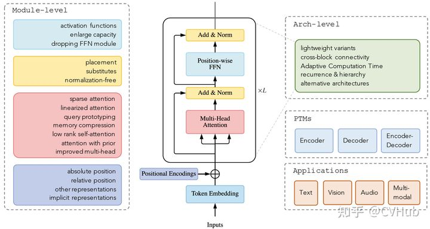

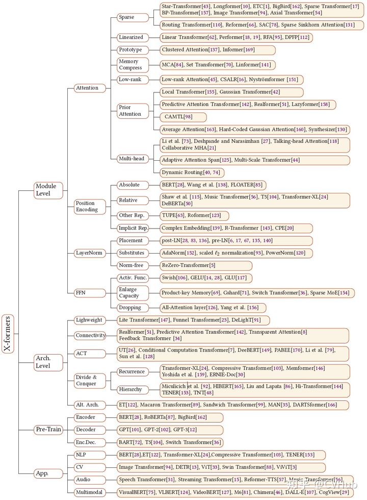

## **改进注意力**

自注意力机制在Transformer架构中起到至关重要的作用，然而实际应用当中仍然面临两大挑战:

*   **Complexity**. 上面我们分析过，Transformer的复杂度为![[公式]](transformer/1625923984-08210759856a54edf6a198888a4d7156.svg)。因此，注意力模块的其中一个瓶颈在于无法处理长序列。
*   **Structural prior**. 自注意力不假设对输入有任何结构性偏见，甚至连重要的顺序信息也需要从训练数据中学习。因此，没有带与训练的Transformer模型通常容易在中小数据上过拟合。 为了提升自注意力机制的整体性能，可以考虑从以下六个方向进行改进： (1) **Sparse Attention**. 这类工作主要是将稀疏偏差引入注意力机制，从而降低复杂性。 (2) **Linearized Attention**. 这一系列工作将注意力矩阵与内核特征图进行解耦，然后通过逆序计算注意力以实现线性复杂度。 (3) **Prototype and Memory Compression**. 这类方法是通过减少queries或key-value对的规模来压缩注意力矩阵的大小。 (4) **Low-rank Self-Attention**. 这一系列工作捕获了自注意力的低秩属性。 (5) **Attention with Prior**. 该研究领域探索用先前的注意力分布来补充或替代标准注意力。 (6) **Improved Multi-Head Mechanism**. 该系列研究探索了多头自注意力机制的替代模块。 下面我们将重点对每种方法进行讲解。

### **Sparse Attention——稀疏注意力**

在标准的自注意力机制中，每个token都需要关注其他所有token。然而，据观察，对于经过训练的Transformers，学习到的注意力矩阵 A 在大多数数据点上通常呈现出一种非常稀疏的状态。因此，可以通过结合结构偏差（删除节点之间的一些连接）来减少每个query关注的query-key对的数量以降低计算的复杂度。

### **Position-based Sparse Attention**

在基于位置的稀疏注意力中，会根据一些预定义的模式来约束注意力矩阵。为此，我们首先确定一些原子稀疏模式；然后描述这些模式在一些现有工作中是如何组成的；最后，只需为特定的数据类型引入了一些扩展的稀疏模式即可。

*   **Atomic Sparse Attention**

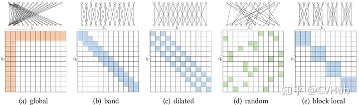

(1) **Global Attention**. 为了缓解在稀疏注意力中对远距离依赖建模能力的下降，可以添加一些**全局节点**作为节点之间信息传播的枢纽。【类比CNN中的GAP】 (2) **Band Attention**(a.k.a sliding window attention or local attention). 由于大多数数据都具有很强的**局部性**，因此很自然地将每个查询限制为**关注其邻居节点**。【类比CNN中的Convolution】 (3) **Dilated Attention**. 通过使用带有空洞的扩张窗口，可以在不增加计算复杂度的情况下潜在地增加波段注意力的感受野。【类比CNN中的Dilated Convolution】 (4) **Random Attention**. 为了增加非局部交互的能力，每个查询随机采样一些边缘。这是基于观察**随机图**可以与完整图具有相似的光谱属性。 (5) **Block Local Attention**. 这类注意力将输入序列分割成几个不重叠的查询块，每个查询块都与一个局部内存块相关联。一个查询块中的所有查询只关注相应内存块中的键。  

*   **Compound Sparse Attention**

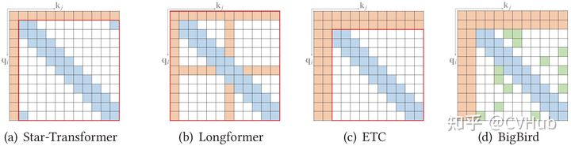

上面我们仅列举了单一形式的注意力单元的连接形式，每种方法都各有优劣，自然而言的就有学者尝试对这些原子操作来一个”**排列组合**“。由于篇幅有限，本文将不展开叙述，有兴趣的读者可自行查阅相关资料，下同。  

*   **Extended Sparse Attention** 除了上述模式，一些现有的研究已经探索了特定数据类型的扩展稀疏模式。比如，BPT针对文本数据构造了一个二叉树，其中所有标记都是叶节点，内部节点是包含许多标记的跨度节点。这种方法可以看作是全局注意力的扩展，其中全局节点是分层组织的，任何一对标记都与二叉树中的路径相连。

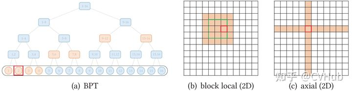

### **Content-based Sparse Attention**

另一行工作基于输入内容创建稀疏图，即稀疏连接以输入为条件。构建基于内容的稀疏图的一种直接方法是选择那些可能与给定查询具有较大相似性分数的键。为了有效地构建稀疏图，我们可以递归到最大内积搜索问题，即尝试通过查询找到具有**最大点积**的键，而无需计算所有点积项。【相当于递归查询，直至找到指定的阈值点积即停止搜索】

### **Linearized Attention——线性注意力**

Transformer生成注意力图的计算复杂度为输入尺寸的二次方。如果能够将![[公式]](transformer/1625923984-39cc307313e7acb2ff8f9b615e7ed81c.svg)分解成![[公式]](transformer/1625923984-8bec8e0640213d0985eab782d47c9d65.svg)，那么就可以通过逆序计算出![[公式]](transformer/1625923984-7bc3415d375093f481578cada2a9f819.svg)，便可以将复杂度降为线性复杂度![[公式]](transformer/1625923984-5327db6996094e6dae229e1ed09af388.svg).其中![[公式]](transformer/1625923984-51d9020f7a89028fa8905549e9b9dc6f.svg)为输入序列的长度。

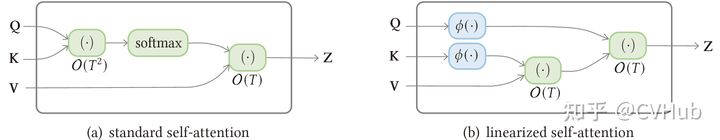

如上图所示，线性的自注意力无非就是通过一些数学变换将非线性的自注意力操作进行映射。

> 除了使用稀疏注意力或线性化注意力之外，还可以通过减少查询或键值对的数量来降低注意力的复杂性。

### **Low-rank Self-Attention——低秩注意力**

一些**经验和理论\[6\]**分析报告称自注意力矩阵通常是低秩的。这个属性的含义是双重的。首先，**低秩属性可以用参数化显式建模**；其次，**可以用低秩近似代替自注意力矩阵**。

### **Low-rank Parameterization**

注意力矩阵的秩小于序列长度意味着，对于输入序列较短的情况，设置![[公式]](transformer/1625923984-f96b7033740d775b0eb18fe06bf05315.svg)将不仅仅是过参数化并容易导致过拟合。 因此，限制![[公式]](transformer/1625923984-e6e8eb4263fbb253a37ebcbe643a44be.svg)的维度以将低秩属性显式建模为归纳偏置是合理的。《Low-Rank and Locality Constrained Self-Attention for Sequence Modeling》这篇论文尝试将子注意力矩阵分解为一个低阶注意力模块，其中包含捕获远距离非局部交互的![[公式]](../../../../Download/mx-wc/transformer/2021-07-10-1625923984/assets/1625923984-e6e8eb4263fbb253a37ebcbe643a44be.svg)（维度较小），以及一个一个捕获局部依赖关系的带注意模块的band attention模块。

### **Low-rank Approximation**

注意力矩阵的低秩属性的另一个含义是可以使用低秩矩阵近似来降低自注意力的复杂性。一种密切相关的方法是核矩阵的低秩近似。这个可以参考之前大家热烈讨论的AAAI 2021的最佳论文奖——**Linformer\[7\]**。论文作者提出另一种用低秩矩阵逼近的方法实现一种新的自注意力机制，在空间和时间复杂度降低到线性时间的情况下取得了与原生Transformer相当的性能。更详细的解读可参考该**链接\[8\]**【有点类似与因式分解】

### **Attention with Prior——为Transformer注入先验信息**

自注意力机制中的注意力分布通常是通过QK对计算的，并将相应的输出叠加到值上进行加权求和。不过，注意力分布也可以来自其它地方，我们将其称为”**先验**“。先验注意力分布可作为QK注意力分布的一种补充，通过融合两种注意力分布可以得到更具有代表性的注意分布，如下图所示：

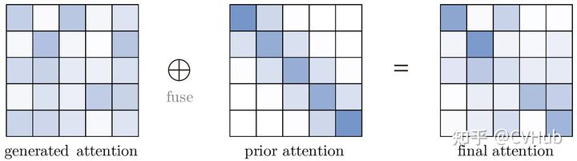

### **Prior that Models locality**

某些类型的数据例如文本可以表现出对位置的强烈偏好。此属性可以显式编码为先验注意力。一个简单的方法是在位置上使用**高斯分布**。具体来说，可以将生成的注意力分布与高斯密度相乘，然后重新归一化，这相当于在生成的注意力分数上添加一个偏差项，其中![[公式]](transformer/1625923984-d013791bce33657a8e8fe0756666dc55.svg)位置的值越高表示输入![[公式]](transformer/1625923984-b1677f9423a31be742701330c190cf05.svg)对![[公式]](transformer/1625923984-ebe2c52df33e9163198c974359a197f2.svg)关注的先验概率越高。

### **Prior from Lower Modules**

在Transformer架构中，经常观察到相邻层的注意力分布相似。因此很自然地可以提供来自前一层的注意力分布作为注意力计算的先验。【类似长距离跳跃链接】

### **Attention with Only Prior**

一些工作探索了使用独立于输入之间成对交互的注意力分布。换句话说，就是这些模型只利用了先验注意力分布。然而，遗憾的是，这些工作大多数都没给出理论支撑，只不过实验结果非常有趣。

## **改进多头机制**

原始的Transformer是基于多头自注意力，作者解释这能让模型的不同的位置互相注意到不同子空间的表征信息。

### **Head Behavior Modeling**

在原始的Transformer实现中，没有明确的机制来保证多个注意力头之间的不同行为可以产生不同的子空间表示，也没有任何机制使各个头之间进行交互。因此，有许多工作致力于于增强每个Head的特征表达能力或者提出某种机制来指导不同Head之间进行交互，进一步增强信息的多样性。

### **Multi-head with Restricted Spans**

一部分研究表明让一部分注意力头关注全局范围，另一部分注意力头关注局部范围可能是更加有益的。主要体现在以下两方面。

### **Locality**

限制注意力跨度会导致显式的局部约束，这对于某些局部性是重要先验的情况下是有利的。

### **Efficiency**

如果实现得当，这样的模型可以扩展到非常长的序列，而不会引入额外的内存占用和计算时间。

限制注意力跨度可以表示为将每个注意力分布值与掩码值相乘，然后重新归一化，其中掩码可以表示为将距离映射到\[0, 1\]中的值的非递增函数。普通注意力为所有距离分配掩码值1，如下图所示：

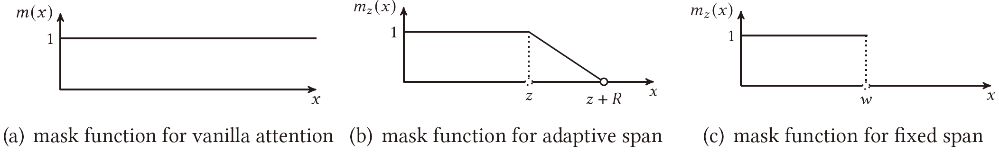

### **Multi-head with Refined Aggregation**

多头注意力在执行完操作之后，原生的Transformer直接将不同的Head进行拼接：

![[公式]](transformer/1625923984-c360051ab9225ac21818050d787adc8b.svg)

这种直接Concatenate的方式显然是比较单(暴)调(力)的，因为简单的讲多个Head逐个聚合的范式并没有充分利用到多头注意力的表现力。因此，有一些工作致力于提出更加复杂的聚合方式来提高不同Head之间融合的效率。

## **其它模块层面的改进**

### **Position Representations**

前面我们提到过，Transformer是对位置信息无感的。然而，在实际应用当中，位置信息是不可或缺的。例如对文本序列建模或者图像信息分类，如果缺乏位置信息将会导致输出序列所表达的含义完全错乱或者图片的上下文语义信息完全乱套。因此，需要额外的机制将位置信息注入到Transformer中。一种常见的设计是首先使用向量表示位置信息，然后将向量作为附加输入注入到模型当中。

### **Absolute Position Representations.**

> 绝对位置编码是通过将位置信息直接融入到输入序列的一种方式。从数学形式上看，对于给定的第![[公式]](transformer/1625923984-b1677f9423a31be742701330c190cf05.svg)个向量![[公式]](transformer/1625923984-388b1a41d582745822473b86f23fb79a.svg),我们在当前位置引入对应的位置向量![[公式]](transformer/1625923984-98fac06c6d3726301cac4878e7969d8c.svg),则经过位置编码后的输出可表示为![[公式]](transformer/1625923984-5db11119afab11721669d3c1f10ccd69.svg),其中![[公式]](../../../../Download/mx-wc/transformer/2021-07-10-1625923984/assets/1625923984-98fac06c6d3726301cac4878e7969d8c.svg)仅依赖于位置编号![[公式]](../../../../Download/mx-wc/transformer/2021-07-10-1625923984/assets/1625923984-b1677f9423a31be742701330c190cf05.svg)。

绝对位置编码包含许多的变种，如**训练式、三角式、递归式以及相乘式**等。其中最常用的便是训练式，如今主流的BERT和GPT模型均采用了这种位置编码形式。 与完全可学习的方法相比，该方法具有归纳性和灵活性，同时具有参数效率。 合并绝对位置表示的原始方法是将位置编码/嵌入添加到标记嵌入中。然而，当输入信号通过层传播时，位置信息可能会在上一层丢失。 后来的工作发现将位置表示添加到每个Transformer层的输入中是更有益的。

### **Relative Position Representations**

> 相对位置编码是一种更加灵活的位置编码方式，它不需要对每个输入的位置信息进行完整建模，而是通过在计算注意力分数之时，考虑当前位置与被注意力的位置之间的相对距离。

相对位置表示侧重于表示Token之间的位置关系，而不是单个Token的位置。直觉是，在自注意力中，输入元素（方向和距离）之间的成对位置关系可能比元素的位置更有益。

### **Other Representations**

上面我们介绍完绝对位置编码和相对位置编码的特点，因此一些研究探索了使用包含绝对和相对位置信息的混合位置表示。

### **Layer Normalization**

层归一化(LN)以及残差连接被认为是一种稳定深度网络训练的机制（例如，减轻不稳定梯度和模型退化）。因此，有一些工作致力于分析和改进LN模块。

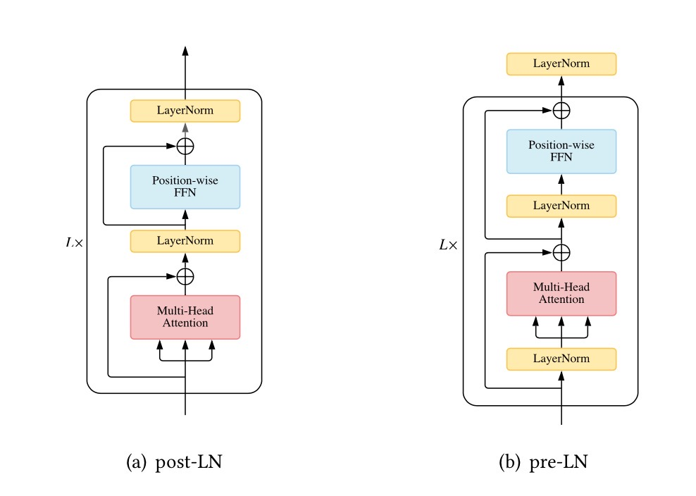

### **Placement of Layer Normalization**

如上图(a)所示，在原始的Transformer实现中，LN层是位于残差块之后的，称为post-LN。然而，基于post-LN的Transformer结构对参数异常敏感，需要大力调(炼)参(丹)才能取得良好的结果，比如需要搭配warm-up学习率策略，但这会非常耗时间。

> warm-up作用一般有两个：减缓模型在初始阶段对mini-batch的提前过拟合现象，保持分布的平稳以及保持模型深层的稳定性。

后来的Transformer实现中，有不少工作是将LN层放置在自注意力或者FFN层之前的残差连接内，称为pre-LN，如上图(b)所示。基于pre-LN的Transformer已被许多后续研究人员所采用。不过，尽管post-LN经常导致不稳定的训练和发散，但它通常在收敛后优于pre-LN变体。研究表明，造成post-LN不稳定的直接原因不是梯度问题，而是在初始化时，对残差分支的更大依赖导致post-LN产生更大的输出偏移，从而导致训练不稳定。为此，有研究人员向post-LN引入额外的参数，控制其残差依赖性，确保了基于post-LN的Transformer收敛，并达到比pre-LN更好的性能。

### **Substitutes of Layer Normalization**

一些研究人员通过实验表明LN模块中的可学习参数在大多数情况下不起作用，甚至还会加速过拟合的风险。因此，有许多工作致力于寻找LN模块的替代品，比如**AdaNorm\[9\]**和**PowerNorm\[10\]**.后者讨论了为什么BN在文本数据的Transformer中表现不佳，并得出结论，BN的显着性能下降源于与其批量统计相关的不稳定性有关。

### **Normalization-free Transformer**

除了LN，还有另一种机制可以构建更深层次的神经网络:

![[公式]](transformer/1625923984-35d1784c158ecbd291a1134ba73f3c9c.svg)

其中![[公式]](transformer/1625923984-b5edc03934564b6fc6a72b7804435505.svg)是零初始化的可学习参数。作者验证了用**ReZero\[11\]**机制替换Transformer中的LN可以为输入信号引入更好的动态等距，并导致更快的收敛。

### **Position-wise FFN**

位置前馈网络(FFN)层对于Transformer实现良好性能至关重要，它为网络提供了非线性映射的能力。如果仅利用Self-Attention层，会导致rank collapse问题，加入FFN层可以有效的缓解该问题。因此，有许多的工作也致力于FFN层的改进。

### **Activation Function in FFN**

原生的Transformer是利用ReLU作为非线性激活函数。随着时间的推移，也提出了许多高效或性能更佳的ReLU变种。比如，著名的**GPT\[12\]**模型便是用**GELU\[13\]**来进一步的替代ReLU，后面也逐渐称为了主流。

### **Adapting FFN for Larger Capacity**

有几项工作专注于扩展FFN层以获取更大的模型容量。基本思想是用具有更多**参数**的类似结构替换FFN。

### **Dropping FFN Layers**

值得注意的是，有人可能会争辩说，在某些情况下，可以完全删除FFN层，从而简化网络。为此，**杨等人\[14\]**通过实验表明，Transformer解码器中的FFN层，尽管其参数很多，但效率不高，可以安全地移除，而性能只有轻微或没有损失。这种方法显着提高了训练和推理速度。

## **改进Transformer架构**

### **Adapting Transformer to Be Lightweight**

除了在模块级别为减轻计算开销做工作外，还可尝试修改Transformer架构使其更加轻量化。比如，**Lite Transformer\[15\]**建议将每个自注意力模块用两个分支结构替代。其中一个分支仍然使用注意力机制来捕获远距离的上下文依赖；而另一个分支使用深度卷积和线性层来捕获局部依赖关系。该架构在模型大小和计算方面都是轻量级的，因此更适合移动设备。

### **Strengthening Cross-Block Connectivity**

在原生的Transformer中，每个块都将前一个块的输出作为输入并输出一系列隐藏表示。沿着这个思路，许多工作致力于研究**多路径聚合**。

### **Transformers with Divide-and-Conquer Strategies**

自注意力对序列长度的二次复杂度会显着限制一些下游任务的性能。例如，语言建模通常需要远距离上下文。下图展示了两种Transformer架构的变体：

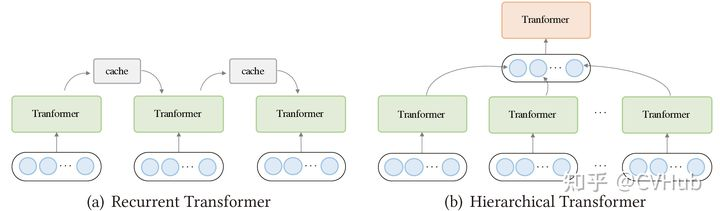

### **Recurrent Transformers.**

在循环Transformers架构中，会维护一个高速缓存(cache)以合并历史信息。比如，在处理一段文本时，网络从缓存中读取作为附加输入。处理完成后，网络通过简单地复制隐藏状态或使用更复杂的机制来写入内存。

### **Hierarchical Transformers**

分层Transformer将输入以层级形式分解为更细粒度的元素。低级特征首先被馈送到 Transformer编码器，产生输出表示，然后聚合（使用池化或其他操作）成高级特征，然后由高级Transformer处理。这类方法可以理解为一个层次抽象的过程，这种方法的优点是分层建模允许模型以有限的资源处理长输入和产生更丰富的对任务有益的特征表示。

## **带预训练的Transformer**

作为与CNN和RNN的一个关键区别，它们固有地结合了局部性的归纳偏置，Transformer则不对数据的结构做出任何假设。一方面，这有效地使Transformer 成为一种非常通用的架构，具有捕获不同范围依赖关系的潜力。另一方面，这使得Transformer在数据有限时容易过拟合。缓解此问题的一种方法是在模型中引入归纳偏置。最近的研究表明，在大型语料库上预训练的Transformer 模型可以学习对下游任务有益的通用语言表示。这些模型是使用各种自监督的目标进行预训练的，例如，根据上下文预测mask。在对模型进行预训练后，可以简单地在下游数据集上对其进行微调，而不是从头开始训练模型。下面介绍一些具体的用法。

### **Encoder only**

一系列工作使用Transformer编码器作为其主干架构。**BERT\[16\]**是典型的PTM，通常用于自然语言理解任务。它利用**Masked Language Modeling**和**Next Sentence Prediction**作为自监督训练的目标。

### **Decoder only**

一些研究侧重于对语言建模的Transformer解码器进行预训练。例如，生成式预训练 Transformer系列，即GPT、GPT-2和GPT-3，专门用于缩放预训练的Transformer解码器，并且最近的研究工作表明大规模PTM可以通过将任务和示例作为构造提示输入模型来实现令人印象深刻的性能。

### **Encoder-Decoder**

也有采用Transformer编码器-解码器作为整体架构的PTM。**BART\[17\]**将BERT的去噪目标扩展到编码器-解码器架构。使用编码器-解码器架构的好处是，诱导模型具备执行自然语言理解和生成的能力。

## **Transformer应用**

Transformer最初是为机器翻译而设计的，但由于其灵活的架构，已被广泛应用于 NLP之外的各个领域，包括CV和音频处理。

### **Natural Language Processing**

Transformer及其变体在NLP任务中得到了广泛的探索和应用，例如机器翻译、语言建模和命名实体识别。大量的工作致力于在大规模文本语料库上预训练Transformer 模型，这是Transformer在NLP中广泛应用的主要原因之一。

### **Computer Vision**

Transformer还适用于各种视觉任务，例如图像分类、目标检测、图像生成和视频处理等。后续小C也会专门针对vision Transformer写一个系列化的总结，敬请期待。

### **Audio Applications**

Transformer还可以扩展到与音频相关的应用，例如语音识别、语音合成、语音增强和音乐生成。

### **Multi-modal Applications**

由于其灵活的架构，Transformer还被应用于各种多模式场景，例如，视觉问答、视觉常识推理、字幕生成、语音到文本翻译 和文本到图像生成。多模态应用未来必定是一个热门的研究方向，有兴趣的读者可以往这上面多发发力。

## **展望**

尽管**X-former**已经证明了它们在各种任务中的能力，但挑战仍然存在。除了当前的关注点（例如效率和泛化）之外，Transformer的进一步改进可能在于以下几个方向。

### **Theoretical Analysis**

Transformer架构已被证明能够支持具有足够参数的大规模训练数据集。许多工作表明，Transformer具有比CNN和RNN更大的模型容量，因此具有处理大量训练数据的能力。当Transformer在足够的数据上进行训练时，它通常比CNN或RNN具有更好的性能【可以参考谷歌爸爸的相关工作《Money Is All You Need》】。一个直观的解释是Transformer对数据结构的先验假设很少，因此比CNN和RNN更灵活。然而，具体理论原因尚不清楚，我们需要对Transformer能力进行一些理论分析。【从模型容量这个角度考虑的话，MLP表示不服】

### **Better Global Interaction Mechanism beyond Attention**

Transformer的一个主要优点是使用注意力机制来模拟输入数据中节点之间的全局依赖关系。然而，许多研究表明，对于大多数节点来说，全局的注意力是不必要的。在某种程度上，无法有效区分地计算所有节点的注意力是低效的。因此，在有效地对全局交互进行建模方面仍有很大的改进空间。一方面，Self-Attention模块可以看作是一个具有动态连接权重的全连接神经网络，它通过动态路由聚合非局部信息。因此，其他动态路由机制是值得探索的替代方法。另一方面，全局交互也可以由其他类型的神经网络建模，例如记忆增强模型。

### **Unified Framework for Multimodal Data**

在许多应用场景中，集成多模态数据对于提高任务性能是有用且必要的。此外，通用人工智能还需要能够捕捉不同模态之间的语义关系。由于Transformer在文本、图像、视频和音频方面取得了巨大的成功，我们有机会构建一个统一的框架，更好地捕捉多模态数据之间的内在联系。然而，模内和跨模态注意力的设计仍有待改进。

## **总结**

本文对Transformer架构进行了深度剖析，并介绍了Transoformer的一些相关变体工作，使读者对其内部结构和外部应用有了更进一步的深入了解。后续小编将专门针对Vision Transformer出一个系列性的总结，探究Transformer在CV领域的可塑性。希望未来能够见到更有意思的多模态工作以及期待Transformer能够早日在工业界落地商用。

### **References**

\[1\] [https://xpqiu.github.io/](https://link.zhihu.com/?target=https%3A//xpqiu.github.io/)

\[2\] [https://arxiv.org/abs/2106.04554](https://link.zhihu.com/?target=https%3A//arxiv.org/abs/2106.04554)

\[3\][https://proceedings.neurips.cc/paper/2014/hash/a14ac55a4f27472c5d894ec1c3c743d2-Abstract.html](https://link.zhihu.com/?target=https%3A//proceedings.neurips.cc/paper/2014/hash/a14ac55a4f27472c5d894ec1c3c743d2-Abstract.html)

\[4\] [https://arxiv.org/abs/1607.06450](https://link.zhihu.com/?target=https%3A//arxiv.org/abs/1607.06450)

\[5\] Relational inductive biases, deep learning, and graph network

\[6\] Low-Rank and Locality Constrained Self-Attention for Sequence Modeling

\[7\] Linformer: Self-Attention with Linear Complexity

\[8\] [https://zhuanlan.zhihu.com/p/149890569](https://zhuanlan.zhihu.com/p/149890569)

\[9\] Understanding and Improving Layer Normalization

\[10\] Batch Normalization: Accelerating Deep Network Training by Reducing Internal Covariate Shift

\[11\] ReZero is All You Need: Fast Convergence at Large Depth

\[12\] Improving language understanding with unsupervised learning

\[13\] Gaussian Error Linear Units (GELUs)

\[14\] Augmenting Self-attention with Persistent Memory

\[15\] Lite Transformer with Long-Short Range Attention

\[16\] BERT: Pre-training of Deep Bidirectional Transformers for Language Understanding

\[17\] BART: Denoising Sequence-to-Sequence Pre-training for Natural Language Generation

