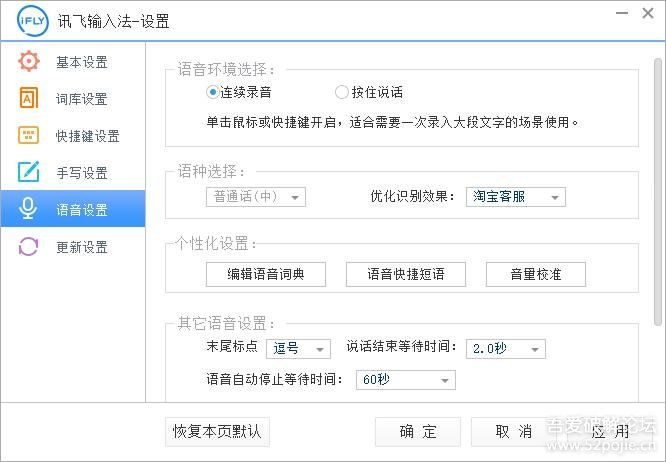
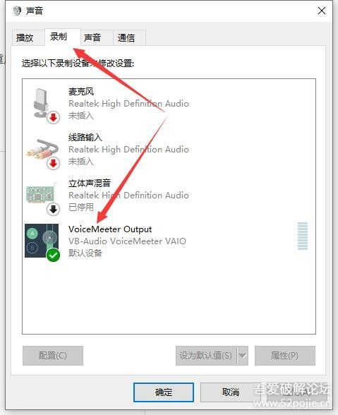
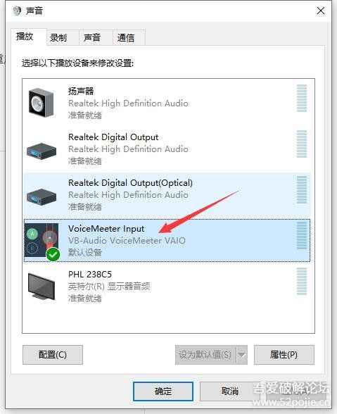
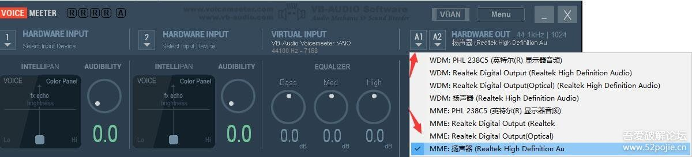

# PC端视频音频语音自动语音识别成文本 - 『精品软件区』 - 吾爱破解 - LCG - LSG |安卓破解|病毒分析|www.52pojie.cn

  
有什么不懂可以私聊

  
  

  
**下载安装**  
1、先下载并安装好讯飞软件并进行设置，打开设置-语音设置-环境选择连续录音  
    
  
  
    
  
2、下载并安装vb-audio，安装很简单，不做多解说！！  
  
  
3、安装好vb-audio后，**需要重启电脑，需要重启电脑，需要重启电脑**，重要多事情多说几次。  
  
  
  
  
软件设置  
1、重启后，进入音量设置。右击声音-选择播放设置  
2、播放和录制选择 VoiceMeeter Output，并设置默认  
    
  
    
  
3、设置Voicemeeter，开始菜单找到并打开如下图  
    
  
  
4、这里选择扬声器  
  
    
5、找部电影测试下效果 ，完美！！